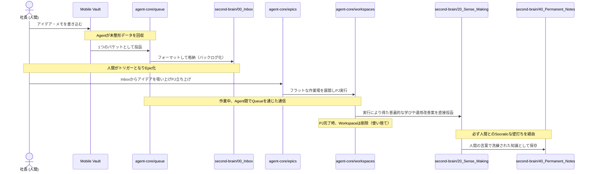

# Data Flow Architecture

You_Inc エコシステムにおける、主要な情報の流れ（データフロー）を定義します。
「情報の入力 → 実行 → 知識の抽出」という完璧な循環ループが根底にあります。

## 究極のデータフロー（知識と実行の循環）

### 各フェーズの詳細
1. **投入と整形 (Input & Format)**: 人間からの入力は Mobile 等から `agent-core/queue/` に入り、Agentが検索可能な形に整形してから `second-brain/00_Inbox/` に格納します。
2. **アイデアの保管 (`00_Inbox`)**: ここは「整形済みのバックログ」として、人間からの指示を待ちます。
3. **プロジェクト実行 (`epics` & `workspaces`)**: 人間がトリガーとなってInboxのアイデアがEpic（プロジェクト）になり、フラットな作業場を展開して実行されます。
4. **出力と抽出 (`Sense_Making`)**: タスク完了の都度、普遍的な学びや運用改善案などのメタ知識はすべて `20_Sense_Making/` へ直接送られます（自己改善ループ）。
5. **知識の永続化 (`Permanent_Notes`)**: Agent単独での永続化は禁止されており、Sense_Makingの学びは必ず人間との壁打ちを経て `40_Permanent_Notes` に昇華されます。

### ⚠️ Queueの処理粒度ルール (Context Engineering)
Queue（`agent-core/queue/`）は厳密な一次元の処理待ちキューとして機能しなければなりません。
- **処理粒度の原則**: Queue直下に配置されるアイテムは、ファイル（例: `handoff_*.md`）であれディレクトリ（例: `packet_xyz/`）であれ、必ず「1つの独立した処理単位（処理粒度）」でなければなりません。
- **分類用ディレクトリの禁止**: 複数の処理単位を格納するための「分類用フォルダ」や「カテゴリ用ディレクトリ」（例: 旧 `harvest_reviews/`）をQueue内に作成することはアーキテクチャ違反として固く禁じます。
- **命名規則**: 処理単位としてディレクトリ（バンドル）を作成する場合、それが処理パケットであることが名称から明白になるよう `packet_*` などの接頭辞を強制します。
