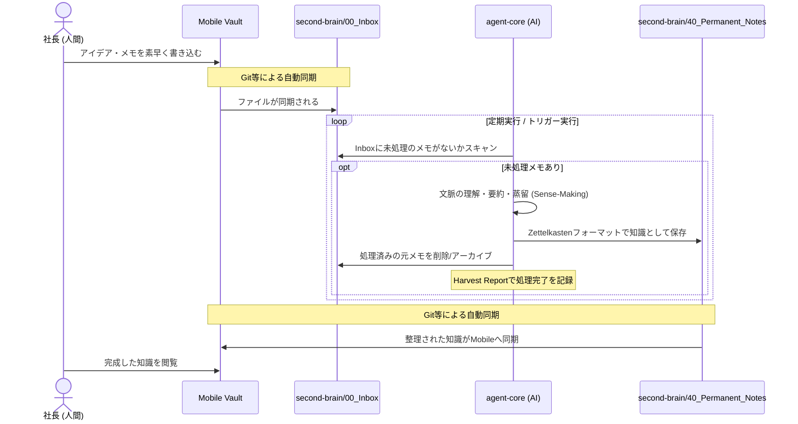

# Data Flow Architecture

You_Inc エコシステムにおける、主要な情報の流れ（データフロー）を定義します。

## メモの作成から知識化（蒸留）までのフロー

人間がモバイルでメモを作成し、それがAIによって処理され永続的な知識になるまでの流れです。

このフローにより、人間は「書く」ことに集中し、AIが「整理・構造化」を自律的に引き受けるオーケストレーションが成立します。
