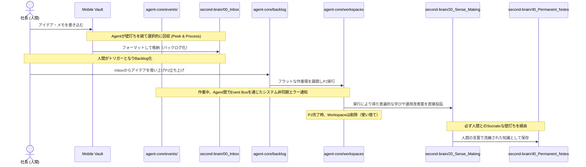
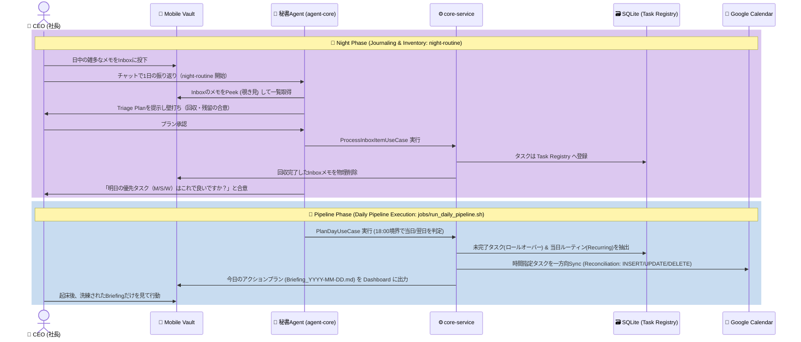

# Data Flow Architecture

You_Inc エコシステムにおける、主要な情報の流れ（データフロー）を定義します。
「情報の入力 → 実行 → 知識の抽出」という完璧な循環ループと、毎日の「日次行動・内省パイプライン（Daily Operational Flow）」が根底にあります。

---

## 1. 究極のデータフロー（知識と実行の循環）

```mermaid
sequenceDiagram
    actor User as 社長 (人間)
    participant Mobile as Mobile Vault
    participant EventBus as agent-core/events/
    participant Inbox as second-brain/00_Inbox
    participant Backlog as agent-core/backlog
    participant Workspace as agent-core/workspaces
    participant SenseMaking as second-brain/20_Sense_Making
    participant PermNotes as second-brain/40_Permanent_Notes
    
    %% フェーズ1: 投入と整形
    User->>Mobile: アイデア・メモを書き込む
    note over Mobile,Inbox: Agentが壁打ちを経て選択的に回収 (Peek & Process)
    Mobile->>Inbox: フォーマットして格納（バックログ化）
    
    %% フェーズ2: プロジェクト実行
    note over User,Inbox: 人間がトリガーとなりBacklog化
    User->>Backlog: Inboxからアイデアを吸い上げPJ立ち上げ
    Backlog->>Workspace: フラットな作業場を展開しPJ実行
    note over Workspace,EventBus: 作業中、Agent間でEvent Busを通じたシステム非同期エラー通知
    
    %% フェーズ3: 学びと改善の抽出 (Continuous Harvesting)
    Workspace->>SenseMaking: 実行により得た普遍的な学びや運用改善案を直接投函
    note over Workspace: PJ完了時、Workspaceは削除（使い捨て）
    
    %% フェーズ4: 知識の永続化
    note over SenseMaking,PermNotes: 必ず人間とのSocraticな壁打ちを経由
    SenseMaking->>PermNotes: 人間の言葉で洗練された知識として保存
```

---

## 2. 日次運用の2フェーズサイクル (Daily Operational Flow)

人間との内省対話（Night Phase）と、システムの計画生成・配信（Pipeline Phase）を分離した日次データフローです。

```mermaid
sequenceDiagram
    actor CEO as 👤 CEO (社長)
    participant MV as 📱 Mobile Vault
    participant Sec as 🤖 秘書Agent (agent-core)
    participant Core as ⚙️ core-service
    participant DB as 🗃️ SQLite (Task Registry)
    participant GCal as 📅 Google Calendar

    %% 🌙 Night Phase: 対話と棚卸し
    rect rgb(220, 200, 240)
        Note over CEO, GCal: 🌙 Night Phase (Journaling & Inventory: night-routine)
        CEO->>MV: 日中の雑多なメモをInboxに投下
        CEO->>Sec: チャットで1日の振り返り（night-routine 開始）
        Sec->>MV: InboxのメモをPeek (覗き見) して一覧取得
        Sec->>CEO: Triage Planを提示し壁打ち（回収・残留の合意）
        CEO->>Sec: プラン承認
        Sec->>Core: ProcessInboxItemUseCase 実行
        Core->>DB: タスクは Task Registry へ登録
        Core->>MV: 回収完了したInboxメモを物理削除
        Sec->>CEO: 「明日の優先タスク（M/S/W）はこれで良いですか？」と合意
    end

    %% 🌅 Pipeline Phase: 計画生成とカレンダー同期
    rect rgb(200, 220, 240)
        Note over CEO, GCal: 🌅 Pipeline Phase (Daily Pipeline Execution: jobs/run_daily_pipeline.sh)
        Sec->>Core: PlanDayUseCase 実行 (18:00境界で当日/翌日を判定)
        Core->>DB: 未完了タスク(ロールオーバー) & 当日ルーティン(Recurring)を抽出
        Core->>GCal: 時間指定タスクを一方向Sync (Reconciliation: INSERT/UPDATE/DELETE)
        Core->>MV: 今日のアクションプラン (Briefing_YYYY-MM-DD.md) を Dashboard に出力
        CEO->>MV: 起床後、洗練されたBriefingだけを見て行動
    end
```

---

## 3. 逆方向の実績回収フロー (Reverse Recovery Flow & Leave No Trace)

社長がMobile側でDashboard（`Briefing_YYYY-MM-DD.md`）のタスクにチェック（`[x]`）を入れた実績は、以下のフローで自動的に回収されます。

1. **実績入力**: Mobile上で `- [x] タスク名` や稼働分数（例: `90`）、メモ（`メモ: 〇〇`）を記入。
2. **Recovery 実行**: 日次パイプライン（`jobs/sync_worklogs.py`）が実行される。
3. **Markdown パース**: `SyncWorklogsUseCase` が `BriefingMarkdownParser` を用いて、ファイル名の日付（`worked_date`）を論理日としてパース。
4. **Task Registry の更新 & 実績記録**:
   - **実績記録**: `worklogs` テーブルに `task_id` と `worked_date` をキーとして実績時間をUPSERT。
   - **単発タスク**: `[x]` が付いたタスクはステータスを `COMPLETED` に更新（Soft Delete）。
   - **定期タスク**: その日の実績を記録し、次回判定用メタデータを更新。
5. **Leave No Trace（自動削除）**: 回収が正常に完了した `Briefing_YYYY-MM-DD.md` は、Mobile Vaultから物理的に自動削除され、モバイル側を常にクリーンに保つ。

---

## 4. アーキテクチャ運用ルール

### ⚠️ Event Busの処理粒度ルール (System Async Events)
Event Bus（`agent-core/events/`）はセッション引き継ぎではなくシステム非同期エラー通知等のためのイベントバスとして機能しなければなりません。
- **処理粒度の原則**: Event Bus直下に配置されるアイテムは、ファイル（例: `error_*.md`）であれディレクトリであれ、必ず「1つの独立した処理単位（処理粒度）」でなければなりません。
- **分類用ディレクトリの禁止**: 複数の処理単位を格納するための「分類用フォルダ」や「カテゴリ用ディレクトリ」をEvent Bus内に作成することはアーキテクチャ違反として固く禁じます。
- **命名規則**: 処理単位としてディレクトリ（バンドル）を作成する場合、それが処理パケットであることが名称から明白になるよう `packet_*` などの接頭辞を強制します。

### ⚠️ イベント駆動型エラーハンドリング (Event Bus 思想)
Agentic OSにおいて、システムエラーは単なる「死蔵されるログ（記録）」ではなく、**「AIエージェントに対する自律修復要求アクション（イベント）」** として扱われます。
- ログ専用ディレクトリ（例: `logs/` や `events/errors/`）へ静的にエラーを出力することは禁止します。
- エラーが発生した場合、必ず `SystemEventGateway` を介して、フラットな「処理待ちエラーパケット（例: `error_generate_daily_briefing_20260721_123456.md`）」として `events/` 直下に投函（Publish）しなければなりません。これにより、エラーがAIの認知（Inbox Triage 等）に入り、自律的な修復タスクへとシームレスに繋がります。
