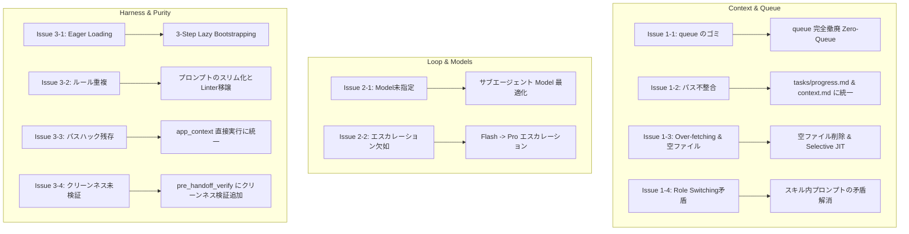

# 00: Identified Issues and Architecture Challenges (課題の網羅的洗い出し)

本ドキュメントは、You_Inc システムの Agent 挙動における現状の課題、ボトルネック、およびアンチパターンを網羅的に記録した正本（SSOT）である。

---

## 1. コンテキストエンジニアリング & コンテキスト純度の課題

### 🔴 Issue 1-1: キュー領域（`queue/`）の残骸蓄積によるコンテキスト汚染 (State Leakage)
- **現状**:
  - `agent-core/queue/` 配下に過去のハンドオフパケット（`handoff_*.md`）やエラーログ（`error_*.md`）が 21 件蓄積。
- **課題とメカニズム**:
  - バックグラウンドで自律的にキューを消費・破棄する Consumer が存在せず、手動・対話主導の運用において完全な「デジタルゴミ箱」化。
  - セッション起動時に `queue/` を走査した際、古いコンテキストがLLMのワーキングメモリに雪崩れ込みハルシネーションを誘発。
- **決定方針**: **`queue/` の完全撤廃（Zero-Queue Architecture）** を採用。タスク引き継ぎは `tasks/context.md` (RAM) と `tasks/progress.md` (HDD) に一元化する。

### 🔴 Issue 1-2: ドキュメント間における Workspace パス・配置ルールの不整合
- **現状**:
  - `session-manager/SKILL.md`: `workspaces/<epic>/progress.md`
  - `workspace_management.md`: `workspaces/<epic>/tasks/progress.md`
  - `development_standard.md`: `workspaces/epics/<epic>/tasks/progress.md`
  - 実体（例: `workspaces/ai_study_sessions/`）では直下と `tasks/` 配下の両方に `progress.md` / `context.md` が重複存在。
- **課題とメカニズム**:
  - LLMが探索時に迷子になり、二重配置された一方だけを更新して状態乖離が発生。

### 🔴 Issue 1-3: 静的ルールの過剰読み込み (Over-fetching) と空ファイルのノイズ
- **現状**:
  - `compliance-reviewer` 等が `docs/rules/` 配下の全ファイルを一括ロード。
  - `core-service/docs/rules/api_gateway.md` のような 97バイトの空スタブ（未記述ファイル）が存在し、無駄にトークンを消費。
- **課題とメカニズム**:
  - 変更内容に関係のない大量のルールや中身のない空ファイルがプロンプトに混入し、Attention の焦点がぼやける。

### 🔴 Issue 1-4: 対話モデルにおける Role Switching と Subagent の境界違反
- **現状**:
  - `zk-distillation-orchestrator/SKILL.md` で、対話スキル `socratic-interviewer` を `invoke_subagent` で呼び出す記述が存在。
  - `night-routine/SKILL.md` 内で、サブエージェント委譲と Role Switching の記述が自己矛盾して混在。
- **課題とメカニズム**:
  - 伝言ゲームによるUX崩壊と、プロンプト・メッセージ中継によるトークン浪費。

---

## 2. ループエンジニアリング & モデル選択の課題

### 🔴 Issue 2-1: サブエージェント呼び出し時のモデル未指定（一律 Pro 継承）
- **現状**:
  - 全 `SKILL.md` において `invoke_subagent` の `Model` 引数が未指定（デフォルト `inherit` = 親モデル Pro）。
- **課題とメカニズム**:
  - 定型フォーマット（`zk-formatter-qa`）、テスト生成（`tdd-red-coder`）、ルール照合（`compliance-reviewer`）など、軽量・高速な `flash` で十分なタスクまで Pro が起動し、レイテンシとコストが肥大化。

### 🔴 Issue 2-2: ループ実行（Self-Healing）における段階的モデルエスカレーションの欠如
- **現状**:
  - 軽微な修正も複雑なリファクタリングも同一モデル（Pro）でループ実行。
- **課題とメカニズム**:
  - 初動 `flash` ➔ 失敗時 `pro` という段階的エスカレーション（Tiered Model Loop）が未導入。

---

## 3. ハーネスエンジニアリング & ルール冗長性の課題

### 🔴 Issue 3-1: 起動時の過剰な先読み (Eager Loading)
- **現状**:
  - セッション開始時に `progress.md` や関連ドキュメントを先読みしようとする。
- **課題とメカニズム**:
  - 起動応答が重くなる。`context.md` (RAM: ≤50行) のみを最優先で読む **3-Step Lazy Bootstrapping** が未徹底。

### 🔴 Issue 3-2: ハードゲート（Linter/AST）で検証可能なルールのプロンプト重複（Harness vs Prompt Imbalance）
- **現状**:
  - `validate_sdd.py` や `audit_skills.py` で既に自動検証されているルールが、`AGENT.md` や各種 `SKILL.md` に自然言語で重複記述されている。
- **課題とメカニズム**:
  - プロンプトの認知負荷（Attention）を無駄に圧迫。「ルールはコード（Linter）で落とし、プロンプトは最小限の文脈のみを渡す」というハーネス原則が徹底されていない。

### 🔴 Issue 3-3: レガシーなパス解決記述の残存（Path Hack Debt）
- **現状**:
  - `priority-planner/SKILL.md` に `cd core-service && PYTHONPATH=src uv run python3 ...` が残存。
  - `tool_design_principles.md` のサンプルコードに `sys.path.insert` が残存。
- **課題とメカニズム**:
  - `agent-core/AGENT.md` で規定された「`app_context.py` による一元的な環境自己解決」と矛盾。

### 🔴 Issue 3-4: `pre_handoff_verify.sh` における検証漏れ（Cleanliness Linterの欠落）
- **現状**:
  - `pre_handoff_verify.sh` はテストとスキル監査のみを実行。
  - `context.md` が50行を超えて肥大化していないか、`scratch/` にゴミファイルが残っていないかの「クリーンネス検証（Leave No Trace Linter）」が存在しない。

---

## 4. 全体最適に向けた論点・依存関係マップ

