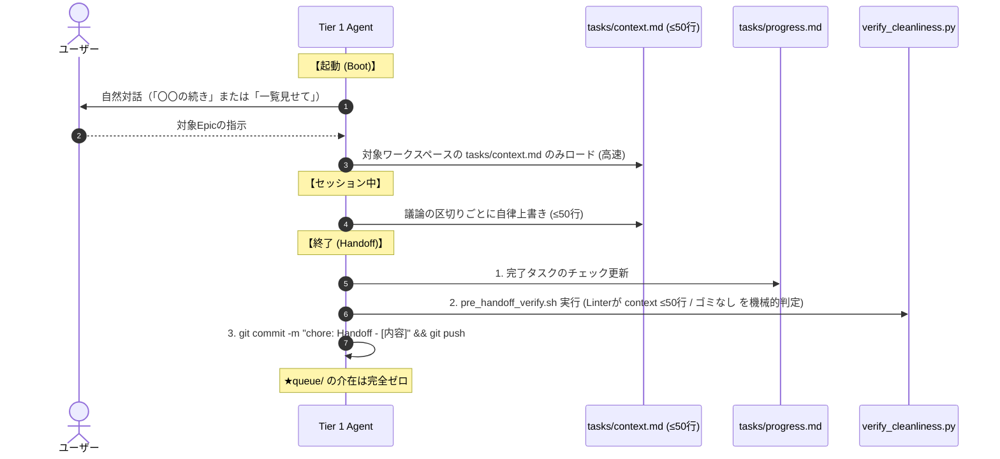

# 01: Cluster 1 - State, Lifecycle & Workspace Architecture (確定仕様)

本ドキュメントは、You_Inc システムにおける「状態管理・ライフサイクル・ワークスペース構造」の全体最適化仕様（Timeless SSOT）である。

---

## 1. ライフサイクルの4段階モデル (Idea to Knowledge)

```mermaid
graph LR
    subgraph 1. アイデアの種
        I[second-brain/00_Inbox/<br>idea_xxx.md]
    end

    subgraph 2. 企画チケット
        B[agent-core/backlog/<br>foo_pipeline.md]
    end

    subgraph 3. 実行現場 (SSOT)
        W[agent-core/workspaces/<br>foo_pipeline/<br>_index.md, docs/, tasks/]
    end

    subgraph 4. 普遍知見 (蒸留)
        P[second-brain/40_Permanent_Notes/<br>普遍的な教訓・ルール]
    end

    I -->|構想が具体化・リンク紐付け| B
    B -->|着手時に昇格| W
    W -->|完了・クリーンアップ時| P
```

---

## 2. ディレクトリと役割の確定仕様

### (1) 未着手企画チケット: `agent-core/backlog/<epic_name>.md`
- **役割**: 未着手のプロジェクト（Epic）の企画チャーター1枚。
- **内容**: 概要、目的、DoD、および `second-brain` 内の関連アイデア・ノートへの Markdown リンク (`[[...]]`)。
- **制約**: ここには実装進捗や細かいTODOは記述しない。

### (2) 実行中ワークスペース: `agent-core/workspaces/<epic_name>/` (自己完結型)
- **役割**: プロジェクト進行中のすべての設計、進捗、現在地を集約する自己完結の作業場。
- **構造**:
  ```text
  workspaces/<epic_name>/
  ├── _index.md        # 📍 チャーター兼エントリーポイント (概要・DoD・status: in_progress)
  ├── docs/            # 📖 設計・決定事項 (SSOT)
  ├── tasks/           # 📋 進行管理・ワーキングメモリ
  │   ├── progress.md  # 💽 静的タスク進捗 (HDD)
  │   └── context.md   # 🧠 動的コンテキスト (RAM: ≤50行)
  └── scratch/         # 🗑️ 一時領域 (Leave No Trace)
  ```
- **配置ルール**:
  - `tasks/progress.md` および `tasks/context.md` のパスを絶対ルールとする。
  - `workspaces/<epic>/` 直下に `progress.md` などを配置することは完全禁止（Linterでブロック）。

### (3) 完了とクリーンアップ (Leave No Trace)
- プロジェクト完了時は、有益なドキュメントや知見を `agent-core/docs/` や `second-brain/40_Permanent_Notes/` に退避・蒸留した上で、`workspaces/<epic_name>/` ディレクトリを完全削除する。

---

## 3. Zero-Queue セッションライフサイクル



---

## 4. 自動防衛ハーネス (`verify_cleanliness.py`)

コミット前（`pre_handoff_verify.sh`）に以下の物理的制約を自動検証する。
1. **RAMサイズ検証**: 全 `workspaces/*/tasks/context.md` が **50行以内** であること。
2. **パス構造検証**: `workspaces/*/` 直下に `progress.md` や `context.md` の重複ファイルが存在しないこと。
3. **ゴミファイル検出**: `agent-core/scratch/` 以外のリポジトリ直下やワークスペース直下に一時ファイルが残っていないこと。
4. **Queue不在検証**: `agent-core/queue/` ディレクトリが存在しない（または空である）こと。
