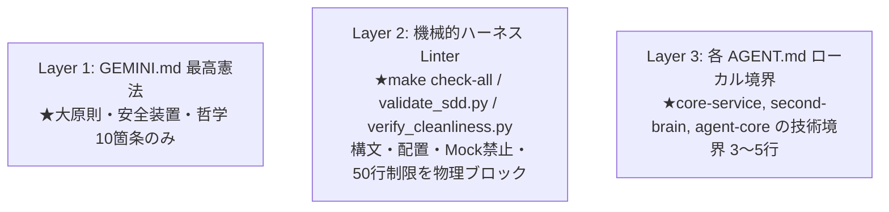

# 03: Cluster 3 - Prompt Purity & Rule Leanization (確定仕様)

本ドキュメントは、You_Inc システムにおける「プロンプト純度・ルール3層分離・SKILLの高付加価値化」の最適化仕様（Timeless SSOT）である。

---

## 1. 3層のルール責務分離 (3-Tier Rule Architecture)

### (1) Layer 1: 最高憲法 (`GEMINI.md`)
- 全リポジトリに適用される大原則（日本語徹底、Git事前コミット、Leave No Trace、職務分離、Timeless SSOT等）のみを集約。

### (2) Layer 2: 機械的ハーネス (`tools/*.py`, `make check-all`)
- 「Mock禁止」「Docstring仕様ID完全一致」「Feature-Driven Packaging」「50行以内」「Orphan Script不在」「二重配置禁止」など、**機械的に判定可能なルールはすべて Linter スクリプトで Exit Code 1 として落とす**。
- プロンプト側で長文の禁止事項を暗記させることを廃止し、「`make check-all` をパスせよ」の1行に集約。

### (3) Layer 3: ローカル境界 (`AGENT.md`)
- リポジトリ固有の技術的境界（ペルソナとWhat）のみを3〜5行で定義。

---

## 2. SKILLのプロンプト純度向上と高付加価値化

機械的ルールをLinterに移譲して空いたプロンプト枠に、以下の「推論品質を引き上げる要素」を注入する。

1. **ドメイン思考フレームワーク (Heuristics)**:
   - 文脈から本質（High/Low Energy、Must/Should、エッジケース）を見抜く思考プロセス。
2. **Few-Shot 事例 (Good Example vs Bad Example)**:
   - 抽象的な禁止事項ではなく、優れたアウトプットと避けるべきアウトプットの実例。
3. **エスカレーション境界**:
   - AI自律で進める領域と、人間に確認すべき不確実性の分水嶺。

---

## 3. クリーンアップとデッドルールの排除

1. **空スタブファイルの削除**:
   - `core-service/docs/rules/api_gateway.md` などの空ファイルを削除。
2. **`night-routine/SKILL.md` の一本化**:
   - 重複記述およびSubagent委譲とRole Switchingの矛盾を削除し、5ステップのRole Switchingパイプラインに一本化。
3. **レガシーなパスハックの完全根絶**:
   - `priority-planner/SKILL.md` の `cd core-service && PYTHONPATH=src ...` を `uv run python agent-core/tools/update_task.py ...` に是正。
   - `tool_design_principles.md` のサンプルコード内の `sys.path.insert` を `app_context.py` 自己解決型に統一。
