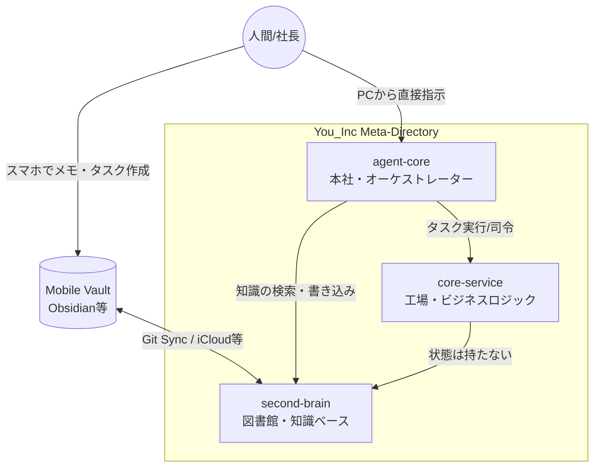

# System Overview

You_Incは「人間（社長）」と「自律エージェント（社員）」が協調して働くためのエコシステムです。
大きく3つのGitリポジトリと、1つのMobile Vaultから構成されます。

## 物理構成図

## 根底にある設計思想 (Core Principles)
1. **second-brain の責務**: 「Agentが検索・活用可能な状態に洗練された知識のリポジトリ（静的・永続的）」。ここには作業中のゴミや未整形のデータを入れてはいけません（純度の保持）。
2. **agent-core の責務**: 「知識を活用してタスクを実行するオーケストレーションの作業場（動的・揮発的）」。ここは常に動き続ける工場であり、作業が終わったもの（完了PJや不要ファイル）は残さずクリーンアップされます。

## 各コンポーネントの責務

1. **agent-core (本社・作業場)**
   - 自律エージェントの頭脳であり司令塔。タスクキューの監視、Epicのフラットな実行環境（workspaces）の提供、他リポジトリのオーケストレーションを行う。
2. **second-brain (図書館)**
   - 情報と知識の永続化レイヤー。実行状態（State）を持たず、Agentが整形済みの種（Inbox）、会社のルール（Areas）、普遍的知識（Permanent Notes）を保管する。
3. **core-service (工場)**
   - APIやビジネスロジックを提供するステートレスなシステムレイヤー。副作用をカプセル化する。
4. **Mobile Vault (出先機関)**
   - 社長がモバイル環境でアイデアやタスクを素早くキャプチャするためのUI/ストレージ。未整形のデータはまず `agent-core` の Queue へ送られ、整形されてから `second-brain` に入る。
