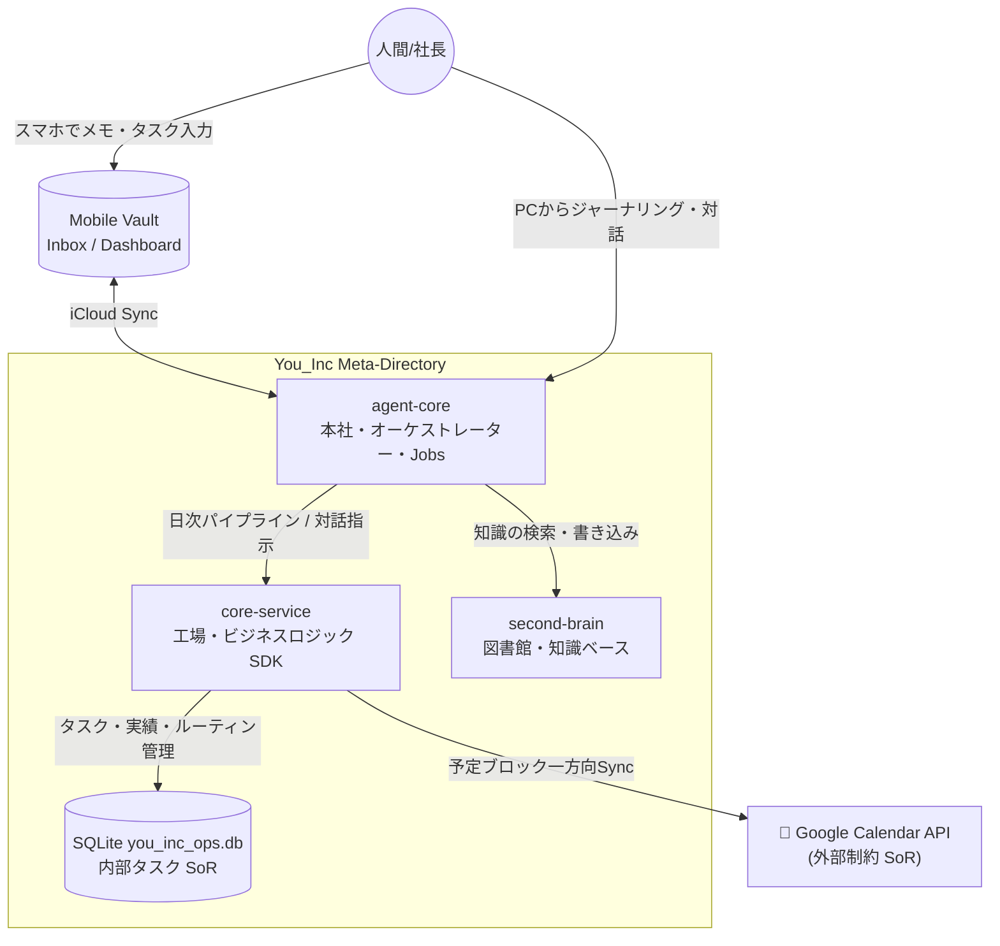

# System Overview

You_Incは「人間（社長/CEO）」と「自律エージェント（秘書/社員）」が協調して働くためのエコシステムです。
大きく3つのGitリポジトリと、1つのMobile Vaultから構成されます。

## 物理構成図

```mermaid
graph TD
    User((人間/社長))
    MobileVault[(Mobile Vault\nInbox / Dashboard)]
    GCal["📅 Google Calendar API\n(外部制約 SoR)"]
    
    subgraph You_Inc [You_Inc Meta-Directory]
        AgentCore[agent-core\n本社・オーケストレーター・Jobs]
        CoreService[core-service\n工場・ビジネスロジック SDK]
        SecondBrain[second-brain\n図書館・知識ベース]
        DB[(SQLite you_inc_ops.db\n内部タスク SoR)]
    end
    
    User -->|スマホでメモ・タスク入力| MobileVault
    MobileVault <-->|iCloud Sync| AgentCore
    User -->|PCからジャーナリング・対話| AgentCore
    
    AgentCore -->|日次パイプライン / 対話指示| CoreService
    CoreService -->|タスク・実績・ルーティン管理| DB
    AgentCore -->|知識の検索・書き込み| SecondBrain
    CoreService -->|予定ブロック一方向Sync| GCal
```

## 根底にある設計思想 (Core Principles)

### 1. The Secretary Paradigm（秘書モデル）
過去の「人間がすべてのタスクリストを監視・管理する」というパラダイムから脱却し、**「agent-coreを自律的な秘書とし、短期タスクの正本（バックログ）を秘書のデータ領域（SQLite `you_inc_ops.db`）に隠蔽する」**というアーキテクチャを採用しています。
* **`second-brain` の純化**: `10_Areas` には人生の信念や長期方針を、`00_Inbox` にはアトミックな「アイデアの種」のみを配置します。「未完了タスク一覧」のようなプレッシャーのかかるファイルは排除します。
* **認知負荷の極小化**: 社長は毎日、配信された「今日やるべきこと（`Briefing_YYYY-MM-DD.md`）」のチェックリストだけを見る運用となります。

### 2. System of Record (SoR) の明確な分離
* **外部要因の SoR = Google Calendar (Read-Only)**:
  * 会議や他人との約束など、外部から制約を受けるスケジュールは Google Calendar を正本とします。
  * **終日予定のメタデータ化**: 時間指定イベントは「物理的な壁（ブロック）」として扱い、終日イベント（有給、祝日等）は日のコンテキストを決定する「メタデータ」として解釈します。
* **内部要因の SoR = Agentic OS DB (`recurring_tasks` / `tasks`) (Write権限)**:
  * 筋トレ、Deep Work、自己投資タスクなどは SQLite を正本とし、Agentが動的にパズルを解いて Google Calendar へ一方向同期（Sync）します。

### 3. 単方向依存ルール (Unidirectional Dependency)
タスク（`agent-core`）と知識（`second-brain`）の間には、厳密な**一方向の依存関係（疎結合）**を維持します。
* ⭕️ **タスク ➡ 知識**: タスクを実行する上で必要なアイデアやマニュアルがある場合、Task Registryのレコード内に `second-brain` へのリンクを保持する。
* ❌ **知識 ➡ タスク**: `second-brain` のMarkdownファイル内に、特定のタスク（DBのIDやURL）へのリンクをハードコードしてはならない。

### 4. タスク種別とライフサイクルの境界ルール (One-off vs Recurring)
* **一回限りタスク (One-off Tasks: `task_type == 'ONE_OFF'`)**:
  * 完了（`COMPLETED`）するまで永続化され、指定日に未完了だった場合は自動的に翌日へ持ち越されます（ロールオーバー）。
* **定期ルーティンタスク (Recurring Tasks: `task_type == 'RECURRING'`)**:
  * その日限りの日次インスタンスとして生成され、未完了であっても翌日へ持ち越しません（ロールオーバー抑止）。翌日はその日のcronルールに従って新規判定・生成します。

---

## 各コンポーネントの責務

1. **agent-core (本社・作業場・Jobs)**
   - 自律エージェントの頭脳であり司令塔。対話スキル（`night-routine` 等）、日次パイプライン（`jobs/run_daily_pipeline.sh`）、Epic実行環境（workspaces）を提供する。
2. **second-brain (図書館)**
   - 情報と知識の永続化レイヤー。実行状態（State）を持たず、Agentが整形済みの種（Inbox）、会社のルール（Areas）、普遍的知識（Permanent Notes / Sense Making）を保管する。
3. **core-service (工場・計算エンジン SDK)**
   - スケジューリングアルゴリズム（9大制約）、Google Calendar Gateway、Mobile Vault Gateway、SQLite Repository をカプセル化したステートレスなシステムレイヤー。
4. **Mobile Vault (出先機関)**
   - 社長がモバイル環境でアイデアやタスクを素早くキャプチャ（Inbox）し、今日のミッションを確認・実績入力（Dashboard）するためのUI/ストレージ。
