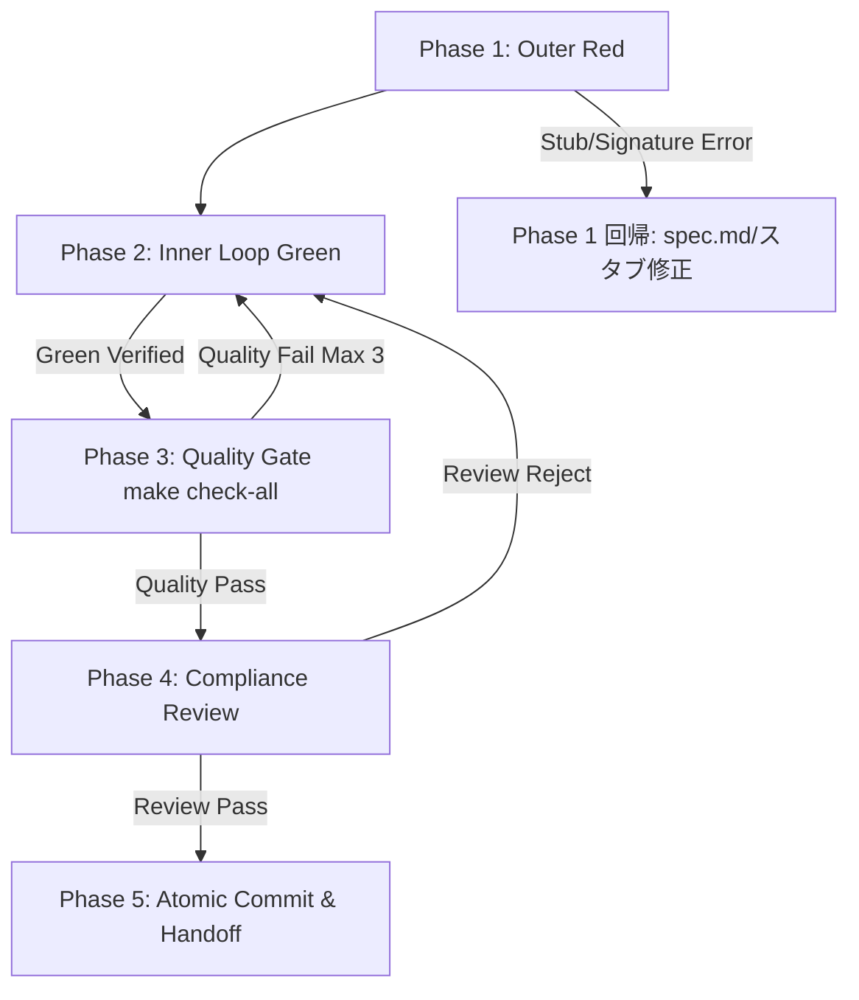

# Skill: SDD Loop Orchestrator (Loop 2: Autonomous TDD Execution / Model: 親 Orchestrator / Pro)

## 🎯 目的
ユーザー承認済みの仕様書（`spec.md`）を受け取り、各専門職ワーカー（サブエージェント）を順序正しく召喚し、機械的な品質ゲート（Exit Code）による物理判定と自律修復（Self-Healing）を行いながら、完全自律で高品質なコードベースを完成・コミットする。

## ⚠️ 絶対遵守ルール
1. **職務分離（Tier 1の不干渉）**: オーケストレーター自身はプロダクションコード（`src/`）やテストコード（`tests/`）を直接編集してはならない。必ずサブエージェント（`invoke_subagent`）に委譲せよ。
2. **自己申告の禁止（Exit Code による物理判定）**: ワーカーの「完了しました」という言葉を信じるな。必ず `agent-core/tools/verify_loop_state.py` の物理実行結果で合否を判定せよ。
3. **自律差し戻し（Self-Healing Loop）**: テスト失敗や品質ゲート違反が発生した場合は、エラーログを添えて直前のワーカーに差し戻せ（最大3回リトライ）。

---

## 🛠️ 実行手順



### Phase 1: Outer Red (Acceptance Test Creation)
*   **入力 (Input)**: ユーザー承認済みの `spec.md`
*   **アクション (Action)**: `invoke_subagent` を用いて `tdd-red-coder` を起動。`spec.md` を渡し、`tests/integration/<domain>/` 配下に結合テストを作成させる（バグ修正時はバグ再現テスト）。
*   **検証 (Gate Check)**:
    ```bash
    uv run python ../agent-core/tools/verify_loop_state.py --phase outer-red --target <test_file_path>
    ```
*   **判定 & ルーティング**:
    - `success: true`（意図通りのアサーションまたは未実装エラー）: `tasks/progress.md` に Proof of Red を記録して Phase 2 へ。
    - **スタブ起因の致命的エラー（`AttributeError` / `TypeError` in `src/`）の場合**: `tdd-red-coder` ではなく、スタブ作成元へ差し戻して型シグネチャを修正。

### Phase 2: Inner Loop & Green (Implementation & Unit Test)
*   **入力 (Input)**: `spec.md` と `tests/integration/` のテストパス
*   **アクション (Action)**: `invoke_subagent` を用いて `tdd-green-refactorer` を起動。実装および `tests/unit/` の単体テスト補強を行わせる。
*   **検証 (Gate Check)**:
    ```bash
    uv run python ../agent-core/tools/verify_loop_state.py --phase green
    ```
*   **判定**: `success: true` であれば Phase 3 へ。失敗時はエラーログを添えて `tdd-green-refactorer` に再委譲。

### Phase 3: Quality Gate Verification ( make check-all )
*   **アクション (Action)**:
    ```bash
    make check-all
    ```
*   **制約事項 (Constraints)**: カバレッジ >= 90%、Ruff lint/format、AST双方向トレーサビリティ検証がすべて Exit 0 であること。
*   **自律修復とエラー・リフレクション (Meta-Cognition & Self-Healing)**:
    - **リトライ状態の追跡**: ループ実行時は `tasks/progress.md` に `[Retry Count: N/3]` を物理記録し、リトライ回数をトラッキングする。
    - **エラー・リフレクション**: 失敗時は闇雲にリトライ（ブルートフォース）するのではなく、「なぜこの品質ゲート（あるいはテスト）に落ちたのか？」という原因の仮説を言語化（エラー・リフレクション）した上で、対象ファイルパス・diff・エラーログと共に `tdd-green-refactorer` に差し戻すこと。
    - 3回失敗時は自律修復を中断し、人間へのエスカレーション境界（Plan A/B提示）として処理を停止する。

### Phase 4: Independent Compliance Review
*   **アクション (Action)**: `invoke_subagent` を用いて `compliance-reviewer` を起動し、合憲性・ルール審査を行わせる。
*   **制約事項 (Constraints)**: 
    - **【仕様の自己修復（セマンティック・レビュー）】**: 変更された実装コードの振る舞いと、`spec.md` の自然言語の記述（該当ID部分）に意味的な矛盾（陳腐化）が生じていないか必ず検証させること。矛盾がある場合は、`spec.md` の記述を修正するよう指示を出して差し戻すこと。
    - レビューで指摘・Reject された場合は、指摘事項をサニタイズして Phase 2 (`tdd-green-refactorer` などの適切なワーカー) へ差し戻す。
    - **【完全ループバック原則】**: 修正後は必ず **Phase 2 (Green) ➔ Phase 3 (Quality Gate) ➔ Phase 4 (Review)** を再走し、デグレがないことを再検証すること。

### Phase 5: Atomic Commit & Progress Update
*   **アクション (Action)**:
    - `git add` および `git commit` を実行。
    - ワークスペースの `tasks/progress.md` のチェックリストを更新し、完了報告を行う。
*   **出力 (Output)**: 完全検証済みのコミットハッシュおよび進捗完了レポート。
