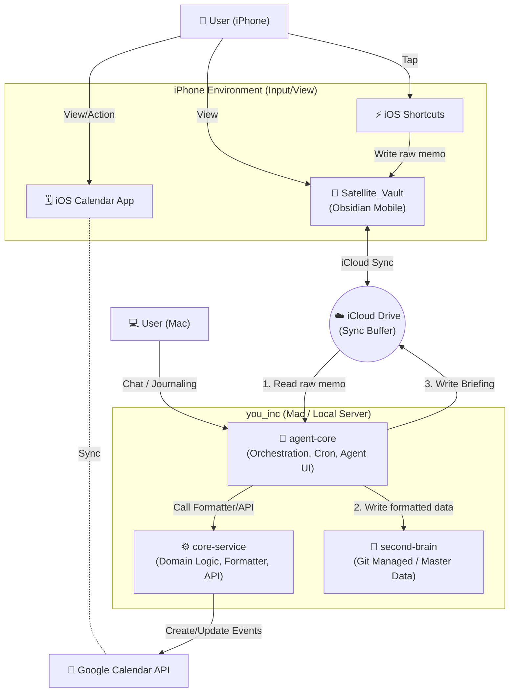
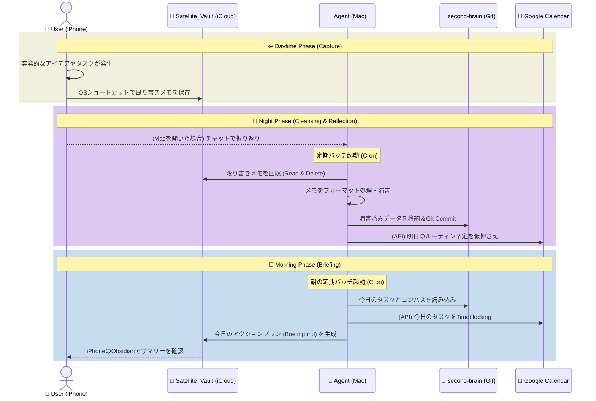

# 01. System Architecture & Data Flow (Dual-Vault Architecture)

本ドキュメントでは、Epic 03「Action & Reflection Pipeline」を支えるシステム構成、Mac上のメイン環境とiPhone上の環境（Satellite Vault）の分離関係、およびデータフローを定義します。

## 1. 新しい名称の提案（Mobile Vaultに代わる名称）

iPhoneとMac間の情報のやり取りを仲介するバッファ（緩衝地帯）としての役割を明確にするため、旧称「Mobile Vault」に代わり、以下のいずれかの名称を提案します（本ドキュメントでは仮に **`Satellite_Vault`（衛星ボルト）** と呼称します）。

* **候補1: `Satellite_Vault` (サテライトボルト)** - メイン（second-brain）の周囲を回り、情報を中継する衛星のイメージ。
* **候補2: `Capture_Hub` (キャプチャハブ)** - iPhoneからの入力を「捕獲」し、集約する場所。
* **候補3: `Transit_Vault` (トランジットボルト)** - 情報が永続化される前の一時的な経由地。

---

## 2. システム構成図 (Architecture Diagram)

`second-brain`（Git管理・清書済み）と `Satellite_Vault`（iCloud管理・一時バッファ）を**完全に別物**として扱うアーキテクチャです。



### 役割の明確化 (Separation of Concerns)
1. **`second-brain`**: 
   - Gitでバージョン管理される、あなた（CEO）の純度の高いナレッジベース本体。手書きの汚いメモは直接ここには入らない。
2. **`Satellite_Vault` (on iCloud)**:
   - iPhoneからの入力を貯める「受付窓口」。
   - iPhoneで見るための「朝のサマリー（Briefing）」が置かれる「掲示板」。
3. **`agent-core` & `core-service`**:
   - `Satellite_Vault` に投げ込まれた生のメモを回収し、条件に合わせて清書（フォーマット処理）を行い、`second-brain` へGitコミットとともに格納する「データクレンジング・パイプライン」の役割を担う。

---

## 3. 1日のデータフロー図 (Daily Operational Flow)



---

## 4. 必要なディレクトリ構成 (Satellite_Vault側)

iPhone側のバッファとなる `Satellite_Vault` は、複雑な階層を持たず、情報の「入り口」と「出口」に特化したシンプルな構成とします。

```text
Satellite_Vault/ (iCloud上の既存ディレクトリを利用)
├── 00_Inbox/         # 【入口】iPhoneからの殴り書きメモ、音声テキストが保存される場所（※Agentの回収対象）
├── 10_Briefing/      # 【出口】Agentが毎朝生成する「今日のサマリー」が置かれる場所（※Agentの上書き対象）
├── 30_Reference/     # 【静的】Agentに回収・変更されない安全なエリア。iPhoneからいつでもサクッと見たい備忘録などを置く
└── 99_System/        # 【システム設定】テンプレートや画像ファイル(Attachments)など、Obsidianの既存システム設定エリア
```

※ **Agentの動作ルール**: Agentの定期バッチがRead & Delete（回収）を行うのは `00_Inbox` のみとし、`30_Reference` や `99_System` 等の静的エリアには一切干渉しないよう実装します。
