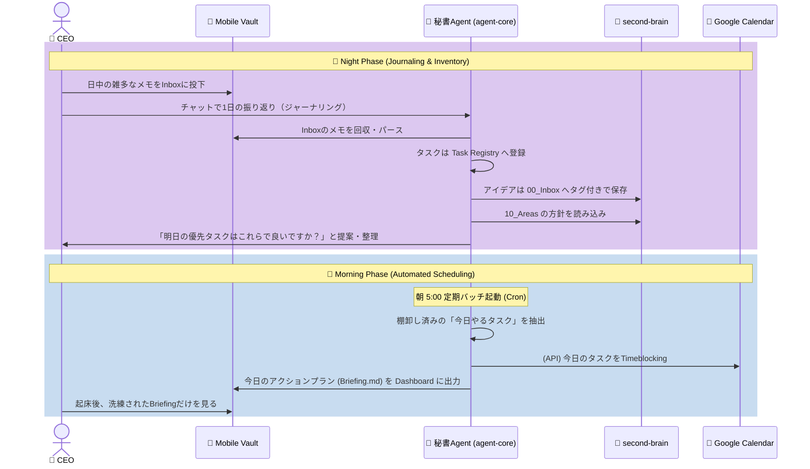

# 01. System Architecture & Data Flow (Secretary Agent Model)

本ドキュメントでは、Epic 03「Action & Reflection Pipeline」を支えるシステム構成、および「CEO（人間）と秘書（AI）」の完全な役割分担に基づくデータフローを定義します。

## 1. コア思想（The Secretary Paradigm）
過去の「人間がすべてを管理する（second-brainに未完了タスクを並べる）」というパラダイムを捨て、**「短期的なタスクのバックログは秘書（agent-core）が隠蔽して管理し、CEO（人間）には今日やるべきこと（Briefing）だけを提示する」**というアーキテクチャを採用します。

*   **`second-brain`（CEOの脳）**: 人生の信念（Areas）、目標、永続的なナレッジ、および未分類の「種（タグ付きのInboxメモ）」のみを格納する純粋な領域。期限付きの細かいタスクは置かない。
*   **`agent-core`（秘書の脳）**: CEOの短期的なタスク（M/S/W）のバックログ（正本）を保持・管理する領域。

---

## 2. システム構成図 (Architecture Diagram)

```mermaid
graph TD
    %% ユーザー境界
    User_iPhone["📱 CEO (iPhone)"]
    User_Mac["💻 CEO (Mac)"]

    %% 外部サービス
    GCal["📅 Google Calendar API"]
    iCloud(("☁️ iCloud Drive\n(Sync Buffer)"))

    %% Mobile側 (iPhone Environment)
    subgraph Mobile_Environment ["iPhone Environment (Interface)"]
        Mobile_Inbox["📥 00_Inbox\n(アイデア/タスクの種)"]
        Mobile_Dashboard["📊 10_Dashboard\n(今日のBriefing)"]
    end

    %% Mac/Server側 (you_inc)
    subgraph you_inc ["you_inc (Mac / Local Server)"]
        subgraph Agent_Core ["🤖 agent-core (秘書)"]
            Task_Registry[("🗃️ Task Registry\n(タスクの正本: JSON/DB)")]
            Orchestrator["指揮・ジャーナリング"]
        end
        core-service["⚙️ core-service\n(機能工場: パース/カレンダー同期)"]
        second-brain["🧠 second-brain\n(信念・ナレッジの正本)"]
    end

    %% リレーションシップ
    User_iPhone -->|雑多な入力| Mobile_Inbox
    User_iPhone -->|閲覧・実績入力| Mobile_Dashboard
    User_Mac -->|ジャーナリング / 棚卸し| Orchestrator

    Mobile_Inbox -->|iCloud| Orchestrator
    Mobile_Dashboard <-->|iCloud| Orchestrator

    Orchestrator -->|1. パース・整理指示| core-service
    Orchestrator <-->|2. タスク保存・読み出し| Task_Registry
    Orchestrator -->|3. 信念(Areas)の参照| second-brain

    core-service -->|予定ブロック作成| GCal
```

---

## 3. データの配置場所と連携ルール

### A. タスクの正本（Task Registry）
*   **場所**: `agent-core/data/task_registry/` (JSONまたはSQLite)
*   **役割**: 短期タスク（M/S/W）の完全なバックログ。CEOは直接見ず、Agentが管理する。

### B. Areasとの連携（信念の適用）
*   **場所**: `second-brain/10_Areas/`
*   **役割**: Agentがタスクの優先順位を判断する際、このディレクトリ内のマークダウン（例: 「健康第一」「英語学習を習慣化」等）をLLMコンテキストとして読み込み、ポリシー（信念）に合致するタスクの優先度を上げる。

### C. Inboxの種（Zettelkastenの担保）
*   **場所**: `second-brain/00_Inbox/`
*   **役割**: Mobile_Vaultから来たメモのうち、「ただのアイデア」や「いつかやりたいこと」はAgentが独立したアトミックノート（`Idea_XXX.md`）としてここに格納し、`#idea` などのタグだけを付与する。

---

## 4. 1日のデータフロー図 (Daily Operational Flow)

単に自動実行するだけでなく、**「人間との対話（棚卸し）」と「システムの自動実行（スケジュール）」を分離**します。


