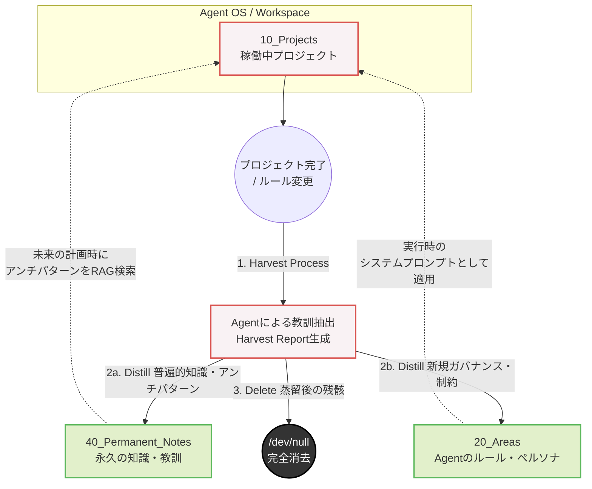

# ADR 0008: Abolish Archives and Adopt "Distill or Delete" Paradigm

## Date
2026-06-13

## Context
Agent-Centricアーキテクチャの推進により、実行層（OS: `10_Projects`等）と知識層（Vault: `40_Permanent_Notes`, `20_Areas`）の分離が進みました。この過程で、過去の遺物を保管する `40_Archives` の存在意義が問われました。
「後で何かに使うかもしれない」という人間の心理的安全性のために残されるアーカイブは、実質的にはゴミ捨て場となり、AgentにとってはRAGの検索対象に混入してハルシネーション（Context Pollution）を引き起こす最大の要因（重力）となります。
「失敗の歴史や教訓は、アンチパターンとしてPermanent Notesへ蒸留（Harvest）すれば解決するのではないか？」という洞察に基づき、中途半端な生データを残す「アーカイブ」という概念そのものをシステムから排除する方針を検討しました。

## Decision
1. **`40_Archives` の完全廃止**: TO-BEアーキテクチャ（新リポジトリ）において、`40_Archives` ディレクトリは作成せず、概念として完全に廃止（Abolish）する。
2. **"Distill or Delete" パラダイムの採用**: プロジェクトの完了時やルールの変更時、すべての情報は以下の二択のフローを強制される。
   - **Distill（蒸留）**: 失敗や教訓、新規ルールは、コンテキストを削ぎ落とした「Permanent Note（アンチパターン等）」として `40_Permanent_Notes` や `20_Areas` へ抽出する。
   - **Delete（削除）**: 蒸留が終わった後のプロジェクトの残骸（生データ、スクリプト、不要なメモ）は、完全に消去（rm -rf）する。
3. **移行戦略**: 現在の `40_Archives` に存在するデータは、新リポジトリへの移行時に「見直して分類・蒸留（Harvesting）」を行った上で、残骸はすべて破棄する。

## Lifecycle & Flow (Distill or Delete)

## Frictions with Existing Decisions (既存の決定との摩擦)

この決定は、システムの純度を飛躍的に高めますが、過去の運用ルールといくつかの摩擦（Friction）を生じます。

1. **`40_Archives/README.md` の制約との摩擦**:
   - 既存の「ReadOnlyの徹底」や「インデックスの遵守（Decisions/ Projects/ History/）」という制約自体が不要になります。新リポジトリではこの制約は引き継がれません。
2. **歴史的ADR（Decisions/）の扱い**:
   - ADRはこれまで「過去の意思決定ログ」としてアーカイブされてきましたが、「Distill or Delete」に従えば、ADRも「現在有効なアーキテクチャルール（20_Areas）」か「過去の失敗から得た教訓（40_Permanent_Notes）」のどちらかに分類・蒸留されなければなりません。純粋な「ログ」としてのADRは破棄の対象となります。
3. **グローバルルールの「フェールセーフ機構」との摩擦**:
   - `GEMINI.md` には「破壊的なファイル操作（削除等）の際は事前にコミットせよ」というフェールセーフがあります。Deleteプロセスを自動化する場合、Agentが「本当に蒸留（Harvest）が完了しているか」を判断する前に削除してしまうリスクがあるため、Gitコミットによるバックアップと人間（ユーザー）の最終承認（Quality Gate）を組み合わせる必要があります。

## Required Skills & Implementations (必要な実装・スキル)

このパラダイムを実現するためには、エージェント側に以下の実装（Skill/SOP）が新たに必要となります。

1. **`project-closer` (プロジェクト終了・蒸留スキル)**:
   - プロジェクトディレクトリを走査し、得られた知見、失敗、アンチパターンを抽出して `Harvest Report` を自動生成するSkill。
   - 生成したレポートを基に、`40_Permanent_Notes` へのPermanent Note作成と、`20_Areas` へのルール追記を自動で行う機能。
2. **アンチパターン・テンプレートの定義**:
   - Permanent Notes内で失敗の歴史を扱うためのフロントマター（例: `type: anti-pattern`, `context: [状況]`, `consequence: [結果]`）の定義。これにより、Agentが未来に同じ過ちを犯しそうになった際、セマンティック検索で容易に自己検知できるようになります。
3. **安全な消去ワークフロー (Safe Delete Flow)**:
   - 蒸留が完了したプロジェクトを削除する際、「対象ディレクトリ全体をGitコミット」→「ユーザーへ承認（Review）をリクエスト」→「承認後に削除（rm -rf）」というステップを踏むためのワークフロー定義（ハルシネーションによる誤削除を防ぐため）。

## Consequences

*   **Positive**: Agentの検索空間から「ノイズ（ゴミ）」が物理的に消滅し、ハルシネーションのリスクが極小化される。知識の昇華（Permanent Notesの成長）がシステム的に強制される。
*   **Negative**: プロジェクト終了時の「Harvest」の認知的負荷（およびAgentの計算コスト）が高くなる。「とりあえず残しておく」ことが許されないため、移行時の棚卸しに大きな労力を要する。
