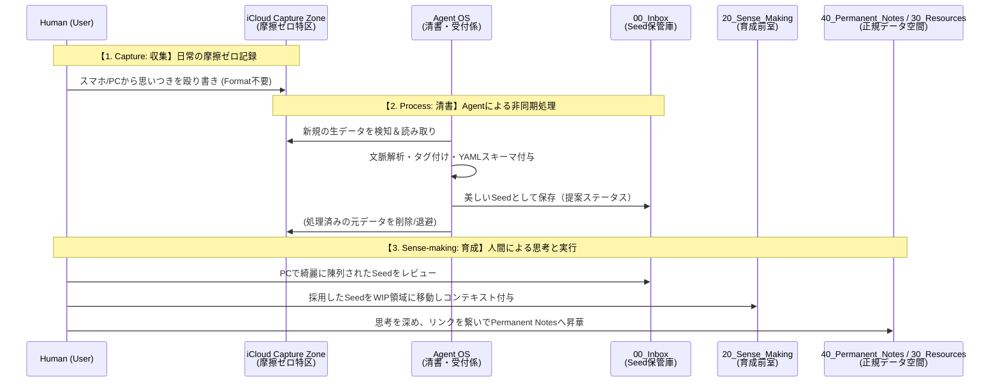

# 04. データガバナンスおよび情報のライフサイクル定義書

> [!WARNING]
> **Status: Deprecated** (この決定事項は最新の `to-be/` アーキテクチャに統合・置換されました)

## 1. 概要
本ドキュメントは、「You, Inc.」アーキテクチャにおいて、Agentたちが一貫した品質でナレッジベース（`second-brain`）を運用するための「情報のライフサイクル」と「厳密な記載フォーマット」を定義する。

---

## 2. 情報のライフサイクルとデータフロー (Information Lifecycle & Data Flow)
情報は以下のサイクルを経て、純度の高いナレッジへと昇華される。Agentはこのライフサイクルに従って情報の移動と変換を行う。



---

## 3. ディレクトリ別 記載フォーマットとルール (Format Definitions for Agents)
Agentの処理品質を均一にするため、`second-brain` 内のMarkdownファイルは以下の厳密なフォーマット（スキーマ）に従うこと。**フォーマット違反のファイルは、Agentによる処理対象外（またはパースエラー）として扱われる。**

### 3.0. 共通ルール (Common Schema)
すべてのMarkdownファイルは、必ず YAML フロントマターを持つこと。
```yaml
---
id: [UUID v4]
created_at: YYYY-MM-DDTHH:MM:SS
updated_at: YYYY-MM-DDTHH:MM:SS
tags:
  - [category/sub-category]
status: [seed | active | paused | completed | permanent]
---
```

### 3.1. `00_Inbox` (Seed保管庫 / 人間のレビュー用ショーケース)
- **概要**: AgentがiCloudの雑書きを清書し、「種（Seed）」や「未整理のタスク（Backlog）」として美しく陳列する場所。
- **制約1（完全フラット構造）**: サブフォルダ（例: `Task/`, `Idea/`）は絶対に作成してはならない。完全なフラットディレクトリとし、分類はすべてメタデータで行う。
- **制約2（厳格なスキーマと記載粒度）**: 自由記述は許されない。Agentは必ず以下のフォーマットでファイルを生成し、元の雑書き（Original Source）をデータ保護のために残さなければならない。
  ```markdown
  ---
  id: [UUID v4]
  created_at: YYYY-MM-DDTHH:MM:SS
  tags: [seed/idea, seed/task, 等]
  status: seed (または backlog, review-pending)
  ---
  # [Agentが付与した適切なタイトル]
  ## 📝 思考の種 (Agentによる要約・構造化)
  - [Agentが読みやすく整形した内容]
  ## 💬 Next Step (Agentからの提案)
  - [移動先やアクションの提案]
  ---
  ## 📦 Original Source
  > [人間の生の雑書きをそのまま引用（データ損失防止）]
  ```

### 3.2. `10_Areas` (ルールのSSOT)
- **概要**: ガバナンスやエージェントのペルソナ制約を管理する最上位の領域。
- **本文フォーマット**: 「ポリシー・制約」と「インライン・ラショナール（なぜそのルールなのかの根拠）」を必ずセットで記述する。
- **Agentの振る舞い**: 行動計画（スケジュール生成など）を行う際、必ず自身の担当するArea（CEO, COO等）のルールノートを参照し、制約を遵守する。

### 3.3. `20_Sense_Making` (WIP領域・育成の前室)
- **概要**: Permanent Notes等へ昇華する前の「文脈付与」を行う作業領域。
- **ステータス**: `active`, `paused`
- **制約**: このディレクトリ内のファイル数が一定数（WIP上限）を超えた場合、新規のタスク開始やアイデア採用をブロックする。

### 3.4. `30_Resources` (材料・生データ保管庫)
- **ステータス**: `archived` または `permanent`
- **概要**: 外部文献やWebクリップ、トレード日誌などの一時情報。Permanent Notesの材料となる。適度なサブフォルダ（階層構造）を許容する。

### 3.5. `40_Permanent_Notes` (不変の知識)
- **ステータス**: `permanent`
- **制約**: 完全フラット構造を維持する。
- **本文フォーマット**: 1ファイル1命題（Atomic）の原則を遵守。
  ```markdown
  # [命題・主張のタイトル]
  ## Core Idea (要約)
  [3行以内で結論を記述]
  ## Details (詳細・論証)
  [詳細な内容]
  ## Connections (関連)
  - 派生元: [[親ノート]]
  - 関連: [[関連ノート]]
  ```
- **Agentの振る舞い**: Agentがこれらを参照する際は、特定のタグに基づきNotebookLM等へ自動同期される。

### 3.6. `90_Meta` (メタデータ隔離領域)
- **概要**: Obsidianの表示に必要な添付ファイル（Attachments）や雛形（Templates）など、システム運用上必要だが意味的知識ではない「非セマンティックデータ」を隔離する境界。
- **制約1（RAGの除外）**: AgentがVault全体を探索・検索する際、`90_Meta` は **絶対にアクセス・インデックス化してはならない（RAG Exclusion Boundary）**。
- **制約2（Markdownの禁止）**: 意味を持つテキスト（ナレッジとしてのMarkdown）をここに格納することは固く禁じられる。
- **Orphaned Attachments フロー（ガベージコレクション）**:
  - `90_Meta/Attachments/` にある画像群のうち、「どのMarkdownからも参照されなくなった孤立した画像（Orphaned Images）」を検知し、自動的に削除（Delete）しなければならない。

---

## 4. 日常の運用イメージ (User Story) と Obsidian UX

システムの使われ方（ユースケース）と、**「Obsidianを通じた具体的な体験（UX）」**を定義する。

### 4.1 日常の運用フロー
*   **【Scene 1: 外出中・移動中 (摩擦ゼロの入力)】**
    *   ユーザーはふと思い浮かんだアイデアやタスクを、iPhoneからiCloudのCaptureディレクトリに「ただのテキスト」として雑に書き捨てて閉じる（認知負荷ゼロ）。
*   **【Scene 2: Agentの裏側での仕事 (自動清書)】**
    *   バックグラウンドでAgentがその雑書きを拾い、YAMLメタデータ（タグ・ステータス）を付与し、人間が読みやすいように構造化して `second-brain/00_Inbox` に並べる。

### 4.2 Obsidian を通じた具体的な体験（UX）
*   **【体験 1: Dataviewによる「動的ダッシュボード」】**
    *   Inboxが完全なフラットディレクトリ化された恩恵により、ユーザーはフォルダを漁る必要がなくなる。Obsidianを開くと、Dataviewプラグインで構築されたダッシュボード（`status: seed` 等のクエリ）が表示され、Agentが綺麗に陳列した「レビュー待ちのアイデア」や「未整理のタスク」だけが美しく一覧表示される。
*   **【体験 2: ノイズのない「純粋なGraph View」】**
    *   `second-brain` 内にはフォーマット違反の生データが一切存在しないため、Obsidian最大の魅力である「Graph View（ナレッジの繋がり）」が、純粋なPermanent Notesネットワークとして極めて高い精度で可視化される。
*   **【体験 3: Sense-making（意味づけ）への集中】**
    *   ユーザーはAgentが清書したカード（Seed）を読み、「なるほど、これはあの概念と繋がるな」と思えば `[[リンク]]` を張り、「これはもう永続化しよう」と思えば `status: permanent` に変更して `30_Resources` へ移すだけとなる。フォーマットを整える「事務作業」から解放され、知識を繋ぐ「思考」のみに集中できる。
