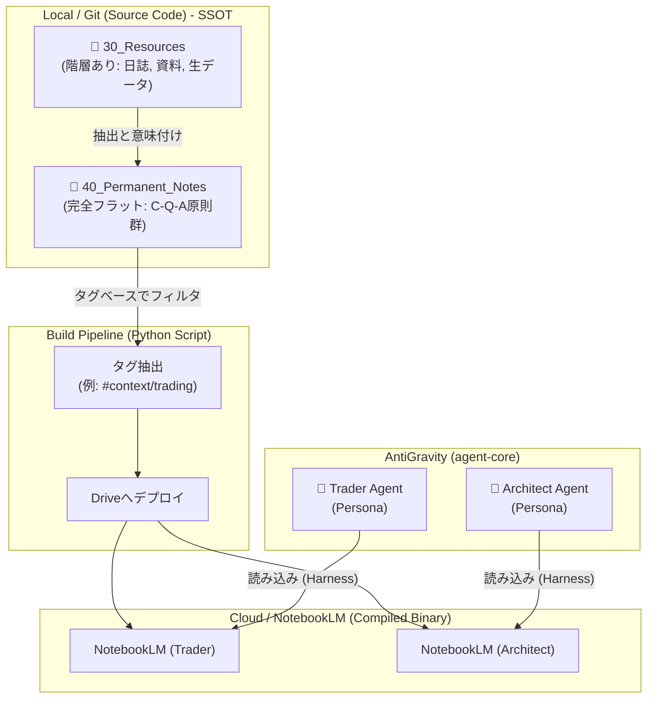
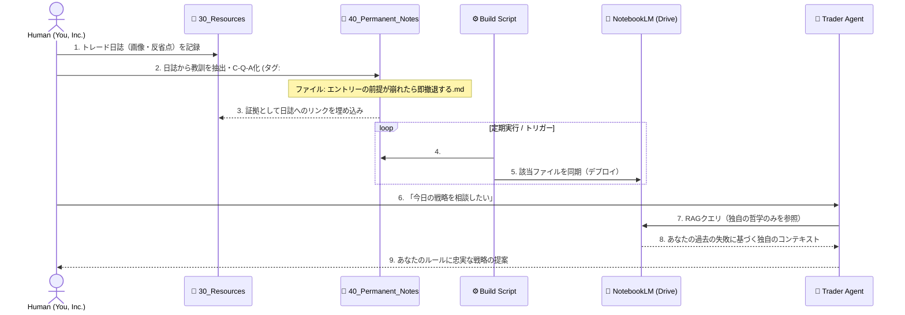

# 06. Knowledge Build Pipeline & Source-Compiled Architecture

> [!WARNING]
> **Status: Deprecated** (この決定事項は最新の `to-be/` アーキテクチャに統合・置換されました)

## 概要
本ドキュメントは、「You, Inc.」アーキテクチャにおける知識の管理とAIへの統合フローを定義します。
最大の特徴は、**ローカル環境（Obsidian + Git）を「知識のソースコード（SSOT）」とし、NotebookLM（Google Drive）を「コンパイル済みの実行用バイナリ」として扱う**設計思想です。

## 1. 全体アーキテクチャ図 (Source vs Compiled)

## 2. ディレクトリ構造の責務分離

| ディレクトリ | 性質・責務 | 構造 | 命名規則・メタデータ |
| :--- | :--- | :--- | :--- |
| **`30_Resources`** | Permanent Notesの「材料」。生データ、他者の記事、トレード日誌、スクショ等。 | **浅い階層構造**（人間が目視検索しやすいため） | 名詞ベース、時系列ベース（例: `20260613_EURUSD.md`） |
| **`40_Permanent_Notes`** | 純粋な「主張・原理原則」。抽出され、結晶化されたYou, Inc.の哲学。 | **完全フラット**（Agentの抽出を最適化するため） | 命題ベース（例: `損切りは未来への再投資である.md`）。文脈はタグで管理 |

### ※ `30_Resources` の名称について
もし「Resources」という言葉が広義すぎて曖昧さを生む場合、`30_Logs_and_References` や `30_Raw_Materials` といった名前に変更することも検討の余地がありますが、PARAメソッド（Projects, Areas, Resources, Archives）への準拠という観点から、まずは `30_Resources` の名称を維持しつつ「Permanent Notesの素材庫である」という責務を明文化して運用します。

## 3. 知識のビルドとハーネスのシーケンス

トレード日誌の記録から、AIエージェントによるトレード戦略アドバイスまでの情報の流れ（フロー）を示します。

