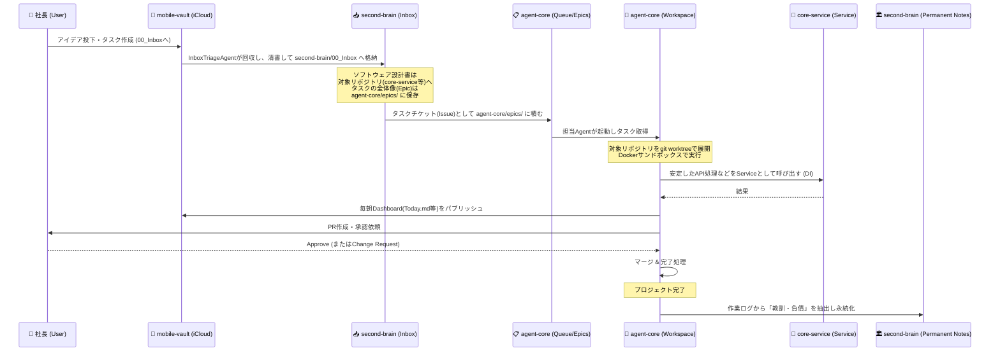

# 00_You, Inc. 全体アーキテクチャ (Overall Architecture)

## 1. コンセプトとメタファー (You, Inc.)
「You, Inc.」は、社長（人間）と自律型AI Agentたちが共に働く「会社」のメタファーに基づいたシステムアーキテクチャです。
システムは、実行・知識・道具という「3つのコア・リポジトリ」に分離され、それぞれが独立したガバナンスとライフサイクルを持ちます。

## 2. 4大コンポーネントの構成と責務

```mermaid
graph TD
    subgraph "You, Inc. (Corporate Architecture)"
        M[mobile-vault<br/>(iCloud/モバイル)]
        V[obsidian-view<br/>(PC向けUI/ダッシュボード)]
        A[agent-core<br/>(会社の現場・オフィス)]
        B[second-brain<br/>(企業内図書館・社長の脳)]
        C[core-service<br/>(情報システム部・道具箱)]
        
        M -->|Inbox回収| A
        A -->|ダッシュボード等を出力| B
        B -->|Dataview等でレンダリング| V
        A -->|ツールとして利用 (DI注入)| C
        A -->|知識の抽出・検索・格納| B
        C -->|仕様化テストで保護| C
    end
```

### ⓪ `mobile-vault` (iCloud / Thin Client)
- **責務**: 人間（社長）が最も頻繁に触れるフロントエンドであり、純粋な入力の送信（Command）、Agentが生成したコンパイル済データの閲覧（Read-Only View）、およびAgent不可侵の個人的なメモ（Private Notes）の保管に特化する。
- **特徴**: モバイル側に複雑なパースロジックは持たせず、Inbox回収とダッシュボード閲覧、そしてプライベート領域の分離という3つのシンプルな責務を保つ。
- **詳細設計**: [40_mobile-vault_architecture.md](./40_mobile-vault_architecture.md)

### ① `agent-core` (Agentの拠点・現場)
- **責務**: Agentのペルソナ管理、タスクのキューイング（Issue管理）、スケジュール実行、および「隔離作業場（Workspace）」の動的展開。
- **特徴**: 実際のコーディングやタスクは、すべてここの `workspaces/` ディレクトリ配下に `git worktree` および Docker サンドボックスを展開して行われる。
- **詳細設計**: [10_agent-core_architecture.md](./10_agent-core_architecture.md)

### ② `second-brain` (知識体系・Permanent Notes)
- **責務**: 会社の戦略（Areas）、普遍的な知識（Permanent Notes）、およびAgentへの指示の種（Inbox）の永続化。
- **特徴**: ソフトウェアの「実行状態」や「ソースコード」は持たない。Agentによる Direct Push を許可する適応型ガバナンスを持つ。
- **詳細設計**: [20_second-brain_architecture.md](./20_second-brain_architecture.md)

### ③ `core-service` (情報システム部・ライブラリ)
- **責務**: 外部API通信やDB操作といった「副作用」をカプセル化したステートレスなServiceの集合体。
- **特徴**: Agentに複雑なI/Oスクリプトを書かせず、品質を安定させるための「堅牢な道具」。シークレットは持たず、実行時に `agent-core` からDIされる。
- **詳細設計**: [30_core-service_architecture.md](./30_core-service_architecture.md)

### ④ `obsidian-view` (フロントエンド層 / 90_Meta内包)
- **責務**: `second-brain` のデータソースを人間（社長）向けに可視化・操作可能にするためのUIレイヤー。
- **特徴**: 純粋なナレッジ（Markdown）とシステム設定（`.obsidian` やダッシュボード生成ファイル）を分離するため、Viewに関する構成要素はすべて `90_Meta/` 配下に集約して管理する。AgentはView設定には干渉せず、データのみを操作する。
- **詳細設計**: [50_obsidian_view_architecture.md](./50_obsidian_view_architecture.md)

---

## 3. 全体データフロー (Data & Lifecycle Flow)

アイデアが生まれ、タスクとして実行され、最終的に「知識」として抽出されるまでの全体の情報の流れ（ライフサイクル）を定義します。



## 4. ガバナンスとコンテキストのルーティング (Lazy-Loading)
本アーキテクチャでは、Agentのハルシネーション（暴走）やコンテキストウィンドウの圧迫を防ぐため、以下の仕組みを全リポジトリに徹底します。
1. **自己記述型リポジトリ**: Agentは作業開始前に、必ず対象リポジトリの `README.md` をロードする。
2. **JIT (Just-In-Time) ロード**: `README.md` は薄い「ルーター」に徹し、Agentは自分のタスクに必要な詳細ルール（`docs/rules/*.md`）だけをピンポイントで追加ロードして実行に移る。
