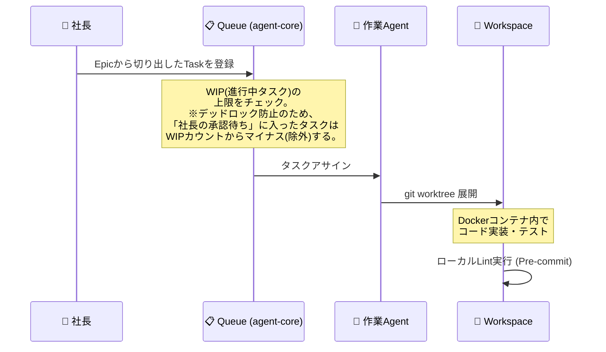

# 11_agent-core 動的運用フロー (Operational Flow)

本ドキュメントは、`agent-core` におけるAgentたちの動的な運用プロトコル（フィードバックループ）を定義します。

## 1. タスクの受付と実行フロー



## 2. フィードバックループ（PRリジェクト・CI失敗時の自律復旧）

Agentが作業を終えてPush（またはPR作成）した後に、エラーや人間からの差し戻しが発生した場合の復旧フローです。

```mermaid
sequenceDiagram
    participant Agent as 🤖 作業Agent
    participant GitHub as 🐙 GitHub (CI / PR)
    participant Reviewer as 🕵️ レビューAgent
    participant User as 👤 社長

    Agent->>GitHub: PR作成 (またはDirect Push)
    
    %% CI失敗時のループとサーキットブレーカー
    GitHub-->>Agent: CI Fail (Webhook検知)
    Note over Agent: 【ルール】再試行は最大3回まで。<br>3回連続失敗で強制停止(Circuit Breaker)し、<br>社長へエスカレーション。
    Agent->>Agent: コード修正して再Push
    
    %% レビューAgentのチェックと無限ループ防止
    GitHub->>Reviewer: PRレビュー依頼
    Reviewer-->>GitHub: Change Requested (修正要求)
    Note over Agent,Reviewer: 【ルール】修正の往復は最大3回まで。<br>合意に至らない場合は強制停止し、<br>社長(マニュアルレビュー)へエスカレーション。
    GitHub-->>Agent: Webhook検知 -> 再作業
    
    %% 社長の最終承認とGrace Period (猶予期間)
    Reviewer->>GitHub: Approve
    Note over GitHub: Human-in-the-loop
    User-->>GitHub: 最終Approve
    Note over Agent: 【重要】マージ検知後、直ちにWorkspaceを削除しない。<br>テキスト類(Harvest, progress, decisions等)のみを残して<br>軽量化(Pruning)し、archived/ へ退避する。
    GitHub-->>Agent: Merge検知 -> 軽量化 & archived/ へ退避
    Note over Agent,User: 人間が Harvest Report をレビュー・承認 (TTL: 7日間)
    User-->>Agent: 教訓承認 (Approve Harvest) または TTL経過
    Agent->>Agent: Workspaceの完全削除 (Teardown)

## 3. マージコンフリクトの解決とフォールバック
複数のEpicが並行して進行し、Agentが作成したPRがコンフリクトした場合の解決フローです。
1. **検知**: GitHubからの Webhook（`mergeable_state: dirty`）を検知。
2. **フォールバック判定**: 
   - **自律解決の許可**: 単純なインポート順の入れ違いやドキュメントの競合のみ、LLMを用いて論理的に解決し Force Push を行う。
   - **エスカレーション**: ロジックの競合など複雑なコンフリクトは、コード破壊を防ぐため自律解決を禁止し、社長（人間）にマニュアル解決を要求する。

## 4. ガベージコレクション (GC) と Teardown
ゾンビ・ワークスペース（放置されたDockerコンテナ等）を防ぐため、以下のトリガーで確実に Teardown（削除）を実行します。
すべての削除処理の**直前**には、必ず「失敗の歴史」や「作業履歴」を失わないための Harvest Report 抽出が行われます。

- **PRが Merge された時**: 成功パターンの教訓を抽出して Teardown。
- **PRが Close (破棄) された時**: なぜダメだったのか（Why NOT）の教訓を抽出して Teardown。
- **タスク自体がキャンセルされた時**: 破棄時と同様に教訓を抽出して Teardown。
- **退避領域の自動パージ (TTL)**: `archived/` に退避されたワークスペースは、7日間人間からの承認アクションがない場合、ストレージ枯渇防止のため自動的に完全消去します。この際、未承認のHarvest Reportがシステムに自動統合されるとハルシネーション（誤った教訓）が永続化する危険があるため、安全側に倒して**破棄（または未承認アーカイブへ隔離）**します。

### 4.1 退避領域の軽量化 (Pruning)
`archived/` へ退避する際、Workspace全体をコピーするとストレージを圧迫するため、以下の「軽量化処理」を必ず行う。
- **残すもの（事後検証用）**: `Harvest_Report_Template.md`、作業ログ(`progress.md`)、失敗ログ(`decisions.md`)。
- **捨てるもの**: `.git`、`node_modules/`、ビルドキャッシュ、コンテナ実体などの全バイナリとコードファイル。

## 5. Direct Push の禁止と許可境界
ガバナンス崩壊を防ぐため、Agentの「PRを介さない Direct Push」は厳格に制限されます。
- **許可される領域**: 
  - `second-brain`（知識体系）の Markdown ファイルに対する**非破壊的な更新**（追記、新規作成、マイナー修正）。
  - Agentが自動生成するダッシュボード（`Today.md` 等）の `mobile-vault/20_Dashboards/` への出力・更新。
- **禁止される領域（PR必須）**: 
  - `agent-core` や `core-service`（システム実行層）のすべてのコード変更。
  - `second-brain` 内であっても、**ファイルの一括削除、大規模なディレクトリ移動、構造全体に影響を与える「破壊的（Destructive）な操作」** は例外なく PR を作成し、人間の承認を得なければならない。

### 5.1 【絶対ルール】自己問答フック（Check-and-Balance）の強制
LLMエージェントが局所解（目の前のタスクへの過集中）に陥り、システム憲法を忘却して破壊的操作を行うことを防ぐため、以下のメタ・ルールを `GEMINI.md` にハードコードし強制します。
- Agentは、`rm`, `mv`, ファイルの一括置換（`multi_replace`等）などの**破壊的ツールを実行する直前**には、必ず思考プロセス（`thought`）内で**「これは GEMINI.md のフェールセーフルール（コミット必須、PR必須）に違反していないか？」と自問自答すること**を義務付ける。
