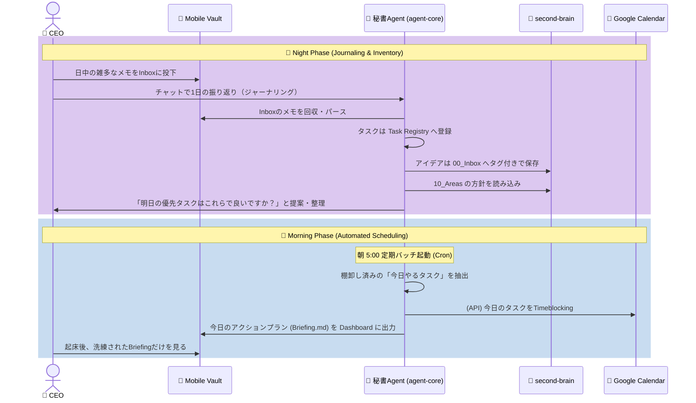

# 01. System Architecture & Data Flow (Secretary Agent Model)

本ドキュメントでは、Epic 03「Action & Reflection Pipeline」を支えるシステム構成、および「CEO（人間）と秘書（AI）」の完全な役割分担に基づくデータフローを定義します。

## 1. コア思想（The Secretary Paradigm）
過去の「人間がすべてを管理する（second-brainに未完了タスクを並べる）」というパラダイムを捨て、**「短期的なタスクのバックログは秘書（agent-core）が隠蔽して管理し、CEO（人間）には今日やるべきこと（Briefing）だけを提示する」**というアーキテクチャを採用します。

*   **`second-brain`（CEOの脳）**: 人生の信念（Areas）、目標、永続的なナレッジ、および未分類の「種（タグ付きのInboxメモ）」のみを格納する純粋な領域。期限付きの細かいタスクは置かない。
*   **`agent-core`（秘書の脳）**: CEOの短期的なタスク（M/S/W）のバックログ（正本）を保持・管理する領域。

---

## 2. システム構成図 (Architecture Diagram)

```mermaid
graph TD
    %% ユーザー境界
    User_iPhone["📱 CEO (iPhone)"]
    User_Mac["💻 CEO (Mac)"]

    %% 外部サービス
    GCal["📅 Google Calendar API"]
    iCloud(("☁️ iCloud Drive\n(Sync Buffer)"))

    %% Mobile側 (iPhone Environment)
    subgraph Mobile_Environment ["iPhone Environment (Interface)"]
        Mobile_Inbox["📥 00_Inbox\n(アイデア/タスクの種)"]
        Mobile_Dashboard["📊 10_Dashboard\n(今日のBriefing)"]
    end

    %% Mac/Server側 (you_inc)
    subgraph you_inc ["you_inc (Mac / Local Server)"]
        subgraph Agent_Core ["🤖 agent-core (秘書)"]
            Task_Registry[("🗃️ Task Registry\n(タスクの正本: SQLite)")]
            Orchestrator["指揮・ジャーナリング"]
        end
        core-service["⚙️ core-service\n(ステートレス計算エンジン)"]
        second-brain["🧠 second-brain\n(信念・ナレッジの正本)"]
    end

    %% リレーションシップ
    User_iPhone -->|雑多な入力| Mobile_Inbox
    User_iPhone -->|閲覧・実績入力| Mobile_Dashboard
    User_Mac -->|ジャーナリング / 棚卸し| Orchestrator

    Mobile_Inbox -->|iCloud| Orchestrator
    Mobile_Dashboard <-->|iCloud| Orchestrator

    Orchestrator -->|1. パース・整理指示(UseCase実行)| core-service
    Orchestrator <-->|2. タスク保存・読み出し| Task_Registry
    Orchestrator -->|3. 信念(Areas)の参照| second-brain

    core-service -->|予定ブロック作成| GCal
```

---

## 2.1 レイヤー間の責務と分離 (Separation of Concerns)

*   **`agent-core` (Orchestrator / Jobs)**: 業務フローの進行状態を管理する司令塔。CronバッチやAIエージェントの対話ループなど「いつ・どういう順序で処理を動かすか」というオーケストレーションの責務を持ちます。
*   **`core-service` (Domain / Application)**: 完全なステートレス・ライブラリ。自律的に起動するジョブを持たず、上位層（`agent-core`）からDIされた設定（Service-Configパターン）と指示（UseCase）に基づいて計算・データ永続化のみを行います。

---

## 3. データの配置場所と連携ルール

### A. タスクの正本（Task Registry）
*   **場所**: `core-service/you_inc_ops.db` (SQLite)
*   **役割**: 短期タスク（M/S/W）の完全なバックログ。CEOは直接見ず、Agentが管理する。

### B. Areasとの連携（信念の適用）
*   **場所**: `second-brain/10_Areas/`
*   **役割**: Agentがタスクの優先順位を判断する際、このディレクトリ内のマークダウン（例: 「健康第一」「英語学習を習慣化」等）をLLMコンテキストとして読み込み、ポリシー（信念）に合致するタスクの優先度を上げる。

### C. Inboxの種（Zettelkastenの担保）
*   **場所**: `second-brain/00_Inbox/`
*   **役割**: Mobile_Vaultから来たメモのうち、「ただのアイデア」や「いつかやりたいこと」はAgentが独立したアトミックノート（`Idea_XXX.md`）としてここに格納し、`#idea` などのタグだけを付与する。

---

## 4. 1日のデータフロー図 (Daily Operational Flow)

単に自動実行するだけでなく、**「人間との対話（棚卸し）」と「システムの自動実行（スケジュール）」を分離**します。



---

## 5. カレンダーとDashboardの責務境界

このシステムにおいて、Google CalendarとDashboard（Briefing.md）は以下の明確な責務境界を持ちます。

### 📅 Googleカレンダー（The Timeline）
*   **責務**: 「時間の確保（Time-blocking）」と「外部との約束（固定予定）」の絶対的な制約。
*   **管理対象**: 時間や場所が完全に固定されているもの（会議、出社、毎週のゴルフなど）。
*   **運用**: Agentはこれを「時間の壁（空き時間計算の制約）」としてのみ扱い、流動タスクをこの空き枠に提案（ブロッキング）します。

### 📊 Dashboard / Briefing.md（The Checklist）
*   **責務**: 「今日1日のミッション（Action Plan）」の提示と「実績の回収」インターフェース。
*   **管理対象**: カレンダー上の固定予定であれ、流動タスクであれ、社長が今日実行すべきすべてのタスク（チェックリスト）。AgentがTask Registryから抽出してここに並べます。

### 💡 なぜ「固定予定（ゴルフ）」もTask Registryで一元管理するのか？
ゴルフなどの時間固定イベントを単にGoogleカレンダーに置くだけでは、「予定を立てた」で終わってしまいます。
Agent側の `Task Registry` （設定マスタ）で一元管理し、Dashboardへ出力させることで、**社長が `[x]`（完了）を付けた実績をシステムが回収し、「今週は自分を回復させるための [W] (Want) の時間をちゃんと取れたか」というウェルネス・トラッキングのデータとして活用する**ことが可能になります。

---

## 6. 逆方向の実績回収フロー (Reverse Recovery Flow)

社長がMobile側でDashboard（Briefing.md）のタスクを完了（`[x]`）した際、その実績は以下のフローで自動的に `Task Registry` に回収されます。

1.  **同期**: Mobile上で `- [x] タスク名` にチェックを入れると、iCloud経由でMacローカルの `Briefing.md` が更新される。
2.  **Night Batch (Recovery Parser)**: 夜のジャーナリング開始前（または深夜バッチ）で、`agent-core/jobs` のバッチプロセスが起動する。
3.  **状態のパース**: バッチから呼び出された `core-service` (UseCase) が `Briefing.md` のMarkdownテキストを解析し、行頭が `- [x]` となっているタスクを正規表現等で抽出する。
4.  **Task Registry の更新**:
    *   **単発タスク**: Task Registry (SQLite) 上で当該タスクのステータスを完了に更新する（Soft Deleteによる論理アーカイブ）。
    *   **定期タスク**: 実績を記録した上で、再帰ルール（例: 毎月末日）に基づき「次回のタスクレコード」を自動生成する。
5.  **リストの再生成**: 翌朝のMorning Batchにて、未完了タスクと新規タスクのみを抽出し、新たな `Briefing.md` としてMobileへ上書き配信する。

---

## 7. ワークスペースのライフサイクルと退避ルール (Workspace Demotion Rule)

`agent-core/workspaces` は、P.A.R.Aメソッドにおける `Projects`（現在アクティブに工事中の現場）に該当します。
プロジェクトが「完了」または「休眠（着手予定なし）」状態になった場合、現場から撤収しなければなりません。

*   **資料の退避**: 構想メモや関連資料は、アイデアであれば `second-brain/00_Inbox` へ、確立されたシステムや価値観であれば `second-brain/10_Areas` へ移動させます。
*   **着手予定の退避**: いつか再開する予定がある場合は、単一のタスクレコードとして `Task Registry` (SQLite) に発行し、退避先のファイルへリンクを貼ります。
*   **撤収**: 最後に、ワークスペースディレクトリ自体を削除（または40_Archivesへ移動）し、アクティブなプロジェクト一覧を常にクリーンに保ちます。

---

## 8. 依存関係の単方向ルール (Unidirectional Dependency)

タスク（`agent-core`）と知識（`second-brain`）の間には、厳密な**一方向の依存関係（疎結合）**を維持します。

*   ⭕️ **タスク -> 知識**: タスクを実行する上で必要なアイデアやマニュアルがある場合、Task Registryのレコード内に `second-brain` へのリンクを保持する。
*   ❌ **知識 -> タスク**: `second-brain` のMarkdownファイル内に、特定のタスク（DBのIDやURL）へのリンクをハードコードしてはならない。

`second-brain` 側のナレッジは「誰から参照されているか」「どのタスクのために存在するか」を知る必要がありません。これにより、タスクが完了・消滅しても、second-brain側のナレッジに不要なゴミリンクが残らず、純粋な知識ベースとして持続可能性を保つことができます。
