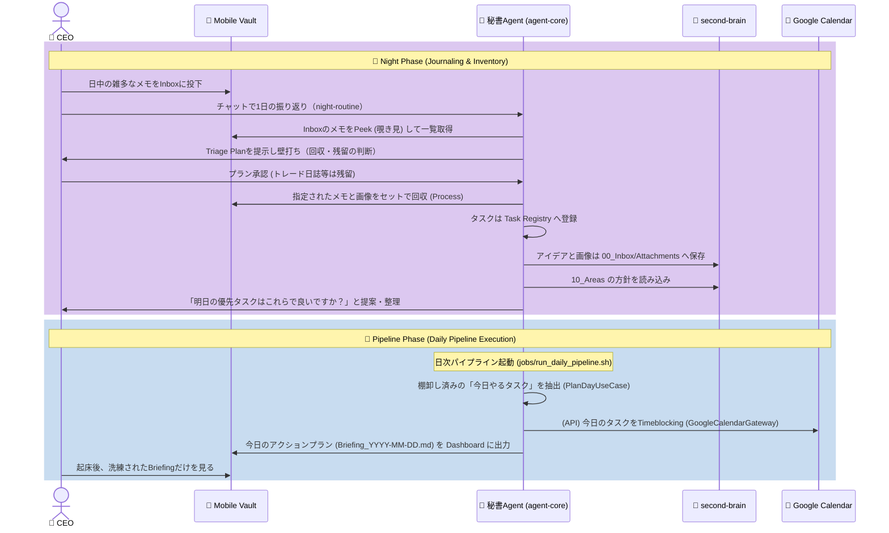

# 01. System Architecture & Data Flow (Secretary Agent Model)

本ドキュメントでは、Epic「Action & Reflection Pipeline」を支えるシステム構成、および「CEO（人間）と秘書（AI）」の完全な役割分担に基づくデータフローを定義します。

## 1. コア思想（The Secretary Paradigm）
過去の「人間がすべてを管理する（second-brainに未完了タスクを並べる）」というパラダイムを捨て、**「短期的なタスクのバックログは秘書（agent-core）が隠蔽して管理し、CEO（人間）には今日やるべきこと（Briefing）だけを提示する」**というアーキテクチャを採用します。

*   **`second-brain`（CEOの脳）**: 人生の信念（Areas）、目標、永続的なナレッジ、および未分類の「種（タグ付きのInboxメモ）」のみを格納する純粋な領域。期限付きの細かいタスクは置かない。
*   **`agent-core`（秘書の脳）**: CEOの短期的なタスク（M/S/W）のバックログ（正本）を保持・管理する領域。

---

## 2. システム構成図 (Architecture Diagram)

```mermaid
graph TD
    %% ユーザー境界
    User_iPhone["📱 CEO (iPhone)"]
    User_Mac["💻 CEO (Mac)"]

    %% 外部サービス
    GCal["📅 Google Calendar API"]
    iCloud(("☁️ iCloud Drive\n(Sync Buffer)"))

    %% Mobile側 (iPhone Environment)
    subgraph Mobile_Environment ["iPhone Environment (Interface)"]
        Mobile_Inbox["📥 Inbox\n(アイデア/タスクの種)"]
        Mobile_Dashboard["📊 Dashboard\n(今日のBriefing_YYYY-MM-DD.md)"]
    end

    %% Mac/Server側 (you_inc)
    subgraph you_inc ["you_inc (Mac / Local Server)"]
        subgraph Agent_Core ["🤖 agent-core (秘書)"]
            Task_Registry[("🗃️ Task Registry\n(タスクの正本: SQLite you_inc_ops.db)")]
            Orchestrator["指揮・ジャーナリング (night-routine)"]
            Pipeline_Jobs["日次ジョブ (run_daily_pipeline.sh)"]
        end
        core_service["⚙️ core-service\n(ステートレス計算エンジン SDK)"]
        second_brain["🧠 second-brain\n(信念・ナレッジの正本)"]
    end

    %% リレーションシップ
    User_iPhone -->|雑多な入力| Mobile_Inbox
    User_iPhone -->|閲覧・実績入力| Mobile_Dashboard
    User_Mac -->|ジャーナリング / 棚卸し| Orchestrator

    Mobile_Inbox -->|iCloud| Orchestrator
    Mobile_Dashboard <-->|iCloud| Orchestrator

    Orchestrator -->|1. パース・整理指示(UseCase実行)| core_service
    Orchestrator <-->|2. タスク保存・読み出し| Task_Registry
    Orchestrator -->|3. 信念(Areas)の参照| second_brain

    Pipeline_Jobs -->|計画生成・実績回収| core_service
    core_service -->|予定ブロック一方向Sync| GCal
    core_service -->|Briefing配信/回収| Mobile_Dashboard
```

---

## 2.1 レイヤー間の責務と分離 (Separation of Concerns)

*   **`agent-core` (Orchestrator / Jobs)**: 業務フローの進行状態を管理する司令塔。日次パイプライン（`jobs/run_daily_pipeline.sh`）やAIエージェントの対話ループ（`night-routine`）など「いつ・どういう順序で処理を動かすか」というオーケストレーションの責務を持ちます。
*   **`core-service` (Domain / Application)**: 完全なステートレス・ライブラリ（SDK）。自律的に起動するジョブを持たず、上位層（`agent-core`）からDIされた設定（Service-Configパターン）と指示（UseCase）に基づいて計算・データ永続化のみを行います。

---

## 3. データの配置場所と連携ルール

### A. タスクの正本（Task Registry）
*   **場所**: `core-service/you_inc_ops.db` (SQLite)
*   **役割**: 短期タスク（M/S/W）の完全なバックログ。CEOは直接見ず、Agentが管理する。

### B. Areasとの連携（信念の適用）
*   **場所**: `second-brain/10_Areas/`
*   **役割**: Agentがタスクの優先順位を判断する際、このディレクトリ内のマークダウン（例: 「健康第一」「英語学習を習慣化」等）をLLMコンテキストとして読み込み、ポリシー（信念）に合致するタスクの優先度を上げる。

### C. Inboxの種（Zettelkastenの担保）
*   **場所**: `second-brain/00_Inbox/`
*   **役割**: Mobile_Vaultから来たメモのうち、「ただのアイデア」や「いつかやりたいこと」はAgentが独立したアトミックノート（`Idea_XXX.md`）としてここに格納し、`#idea` などのタグだけを付与する。

---

## 4. 1日のデータフロー図 (Daily Operational Flow)

単に自動実行するだけでなく、**「人間との対話（棚卸し）」と「システムのパイプライン実行（スケジュール）」を分離**します。

```mermaid
sequenceDiagram
    actor CEO as 👤 CEO
    participant MV as 📱 Mobile Vault
    participant Sec as 🤖 秘書Agent (agent-core)
    participant SB as 🧠 second-brain
    participant GCal as 📅 Google Calendar

    %% 夜の対話と棚卸し
    rect rgb(220, 200, 240)
        Note over CEO, GCal: 🌙 Night Phase (Journaling & Inventory)
        CEO->>MV: 日中の雑多なメモをInboxに投下
        CEO->>Sec: チャットで1日の振り返り（night-routine）
        Sec->>MV: InboxのメモをPeek (覗き見) して一覧取得
        Sec->>CEO: Triage Planを提示し壁打ち（回収・残留の判断）
        CEO->>Sec: プラン承認 (トレード日誌等は残留)
        Sec->>MV: 指定されたメモと画像をセットで回収 (Process)
        Sec->>Sec: タスクは Task Registry へ登録
        Sec->>SB: アイデアと画像は 00_Inbox/Attachments へ保存
        Sec->>SB: 10_Areas の方針を読み込み
        Sec->>CEO: 「明日の優先タスクはこれらで良いですか？」と提案・整理
    end

    %% パイプライン実行（夜の対話終了時または早朝）
    rect rgb(200, 220, 240)
        Note over CEO, GCal: 🌅 Pipeline Phase (Daily Pipeline Execution)
        Note over Sec: 日次パイプライン起動 (jobs/run_daily_pipeline.sh)
        Sec->>Sec: 棚卸し済みの「今日やるタスク」を抽出 (PlanDayUseCase)
        Sec->>GCal: (API) 今日のタスクをTimeblocking (GoogleCalendarGateway)
        Sec->>MV: 今日のアクションプラン (Briefing_YYYY-MM-DD.md) を Dashboard に出力
        CEO->>MV: 起床後、洗練されたBriefingだけを見る
    end
```

---

## 5. カレンダーとDashboardの責務境界

このシステムにおいて、Google CalendarとDashboard（`Briefing_YYYY-MM-DD.md`）は以下の明確な責務境界を持ちます。

### 📅 Googleカレンダー（The Timeline）
*   **責務**: 「時間の確保（Time-blocking）」と「外部との約束（固定予定）」の絶対的な制約。
*   **管理対象**: 時間や場所が完全に固定されているもの（会議、出社、毎週のゴルフなど）。
*   **運用**: Agentはこれを「時間の壁（空き時間計算の制約）」としてのみ扱い、流動タスクをこの空き枠に提案（ブロッキング）します。

### 📊 Dashboard / Briefing_YYYY-MM-DD.md（The Checklist）
*   **責務**: 「今日1日のミッション（Action Plan）」の提示と「実績の回収」インターフェース。
*   **管理対象**: カレンダー上の固定予定であれ、流動タスクであれ、社長が今日実行すべきすべてのタスク（チェックリスト）。AgentがTask Registryから抽出してここに並べます。

### 💡 なぜ「固定予定（ゴルフ）」もTask Registryで一元管理するのか？
ゴルフなどの時間固定イベントを単にGoogleカレンダーに置くだけでは、「予定を立てた」で終わってしまいます。
Agent側の `Task Registry` （設定マスタ）で一元管理し、Dashboardへ出力させることで、**社長が `[x]`（完了）を付けた実績をシステムが回収し、「今週は自分を回復させるための [W] (Want) の時間をちゃんと取れたか」というウェルネス・トラッキングのデータとして活用する**ことが可能になります。

---

## 6. 逆方向の実績回収フロー (Reverse Recovery Flow & Leave No Trace)

社長がMobile側でDashboard（`Briefing_YYYY-MM-DD.md`）のタスクを完了（`[x]`）した際、その実績は以下のフローで自動的に `Task Registry` に回収されます。

1.  **同期**: Mobile上で `- [x] タスク名` にチェックを入れると、iCloud経由でMacローカルの `Briefing_YYYY-MM-DD.md` が更新される。
2.  **Recovery Execution**: 日次パイプライン（`jobs/sync_worklogs.py`）が実行される。
3.  **状態のパース**: `SyncWorklogsUseCase` が `BriefingMarkdownParser` を用いてMarkdownテキストを解析し、`- [x]` や実績分数、メモ（`メモ: 〇〇`）を抽出する。
4.  **Task Registry の更新 & 実績UPSERT**:
    *   **単発タスク**: Task Registry (SQLite `tasks` テーブル) 上でステータスを `COMPLETED` に更新する（Soft Deleteによる論理アーカイブ）。
    *   **実績記録**: `worklogs` テーブルに `task_id` と `worked_date` をキーとして実績時間をUPSERTする。
5.  **Leave No Trace（ファイルの自動削除）**: 回収が正常に完了した `Briefing_YYYY-MM-DD.md` は、Mobile Dashboardから物理的に自動削除され、モバイル側を常にクリーンな状態に保つ。

---

## 7. ワークスペースのライフサイクルと退避ルール (Workspace Demotion Rule)

`agent-core/workspaces` は、P.A.R.Aメソッドにおける `Projects`（現在アクティブに工事中の現場）に該当します。
プロジェクトが「完了」または「休眠（着手予定なし）」状態になった場合、現場から撤収しなければなりません。

*   **資料の退避**: 構想メモや関連資料は、アイデアであれば `second-brain/00_Inbox` へ、確立されたシステムや価値観であれば `second-brain/10_Areas` へ移動させます。
*   **着手予定の退避**: いつか再開する予定がある場合は、単一のタスクレコードとして `Task Registry` (SQLite) に発行し、退避先のファイルへリンクを貼ります。
*   **撤収**: 最後に、ワークスペースディレクトリ自体を削除（または40_Archivesへ移動）し、アクティブなプロジェクト一覧を常にクリーンに保ちます。

---

## 8. 依存関係の単方向ルール (Unidirectional Dependency)

タスク（`agent-core`）と知識（`second-brain`）の間には、厳密な**一方向の依存関係（疎結合）**を維持します。

*   ⭕️ **タスク -> 知識**: タスクを実行する上で必要なアイデアやマニュアルがある場合、Task Registryのレコード内に `second-brain` へのリンクを保持する。
*   ❌ **知識 -> タスク**: `second-brain` のMarkdownファイル内に、特定のタスク（DBのIDやURL）へのリンクをハードコードしてはならない。

`second-brain` 側のナレッジは「誰から参照されているか」「どのタスクのために存在するか」を知る必要がありません。これにより、タスクが完了・消滅しても、second-brain側のナレッジに不要なゴミリンクが残らず、純粋な知識ベースとして持続可能性を保つことができます。
