# ABC目標とYou_Incの統合アーキテクチャ (Workflow)

このドキュメントは、会社のABC目標をYou_Incのタスク管理・自動化基盤に統合するための「PLAN ➡ DO ➡ CHECK」の全体フローを定義したものです。

## 1. 業務フロー図 (Mermaid)

```mermaid
sequenceDiagram
    autonumber
    actor President as 社長 (You_Inc)
    participant SKILL as abc-goal-planner (SKILL)
    participant SSOT as 10_Areas (Markdown)
    participant System as Task Registry (SQLite)
    participant DB as Worklogs (実績DB)
    participant Batch as generate_abc_evidence

    %% PLAN フェーズ
    rect rgb(20, 20, 50)
    Note over President,SSOT: [PLAN] 半期に1回: 目標設定
    President->>SKILL: 「今期の目標を設定したい」
    SKILL->>President: 会社ルールとYou_Incビジョンを基に壁打ち
    SKILL->>SSOT: 2026_H2_ABC_Goals.md を生成 (SSOT確定)
    end

    %% DO フェーズ
    rect rgb(20, 50, 20)
    Note over SSOT,System: [DO] 目標のタスク化
    SKILL->>System: 目標をEpicとTaskに分解してInsert
    System->>President: 毎朝の Briefing.md でタスクを割り当て
    President->>DB: タスク実行 & ジャーナリング (実績の蓄積)
    end

    %% CHECK フェーズ
    rect rgb(50, 20, 20)
    Note over System,Batch: [CHECK] 毎月月末: エビデンス提出
    System->>Batch: 第4土曜日にバッチ起動
    Batch->>DB: 今月の完了タスクと学習時間を抽出
    Batch->>President: Evidence_Template.md に沿ったレポートを出力
    President->>President: 内容を確認し、会社システムへコピペ提出
    end
```

## 2. 各フェーズの役割と制約

### [PLAN] 目標設定フェーズ
- **役割**: 会社から求められる評価軸と、You_Incとしての成長軸（10_Areas）を一致させる。
- **制約**: このフェーズの成果物は、必ずMarkdownファイルとして `second-brain/10_Areas/02_Professions/ABC_Goals/` 配下にSSOTとして静的に保存すること。

### [DO] 実行管理フェーズ
- **役割**: 半期の巨大な目標を、日々のコンテキストに落とし込めるアトミックなTaskに分解する。
- **制約**: 既存の `generate_daily_briefing.py`（朝の自動スケジューリング）のロジックは変更せず、単に Task Registry のDBレコード（EpicとTask）としてデータを流し込む設計とする。

### [CHECK] エビデンス生成フェーズ
- **役割**: 月末の進捗報告・エビデンス提出にかかる摩擦と認知コストを極限まで下げる。
- **制約**: レポートの内容は、日々の作業ログ（Worklogs）や完了タスクから動的に抽出する。人間が行うのは「フォーマット化された成果物の確認とコピペ」のみとする。
