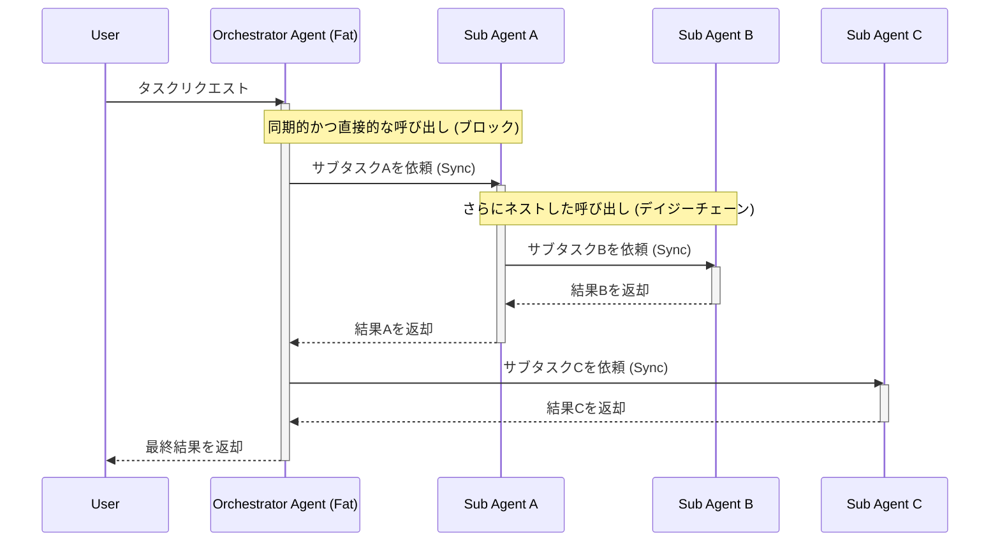

# AS-IS Architecture: Fat Orchestration

## 概要
現状のシステムは「Fat Orchestration」モデルを採用しています。このアーキテクチャでは、エージェントが他のサブエージェントを同期的に呼び出し（デイジーチェーン）、応答を待つ間処理がブロックされる構造となっています。

## アーキテクチャ図解

## 現状の課題 (Issues)
既存調査 (`investigation_round3_orchestration.md` 等) に基づく現在のアーキテクチャの主な課題は以下の通りです：

1. **深いコールスタック (Deep Call Stacks)**
   - エージェントの呼び出しが連鎖（デイジーチェーン）することで、コールスタックが非常に深くなり、デバッグや追跡が困難になります。

2. **密結合 (Tight Coupling)**
   - 呼び出し元と呼び出し先のエージェントが直接的に依存し合っているため、システム全体が密結合となっています。新しいエージェントの追加や既存エージェントの変更が難しくなります。

3. **スケーラビリティと耐障害性の制限 (Limited Scalability & Fault Tolerance)**
   - 応答を待つ間（Wait）、呼び出し元エージェントのリソース（スレッドなど）がブロックされたままになります。これによりシステム全体のスケーラビリティが損なわれ、一部のサブエージェントでの遅延や障害が上位エージェントに直結するため、システム全体のダウンやデッドロックのリスクが高まります。
