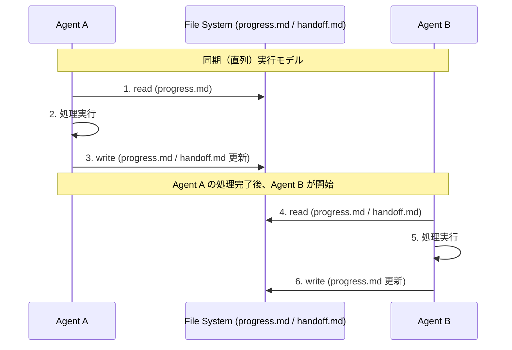
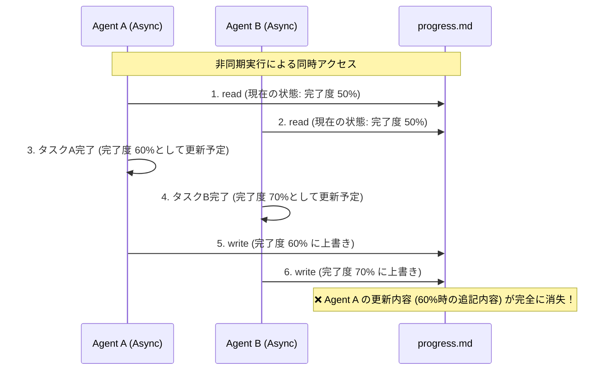

# 現状の状態管理とデータフロー (AS-IS State Data Flow)

## 1. 状態管理の現状

現在のアーキテクチャでは、複数のエージェントが連携してタスクを遂行する際、コンテキストや進捗の共有にファイルシステム上のドキュメント（`progress.md` や `handoff.md` など）を利用しています。

- **`progress.md`**: 各エージェントが自身のタスクの進捗、完了したステップ、次にやるべきことを記録するファイル。
- **`handoff.md`**: 次のエージェントに対して、必要なコンテキストや引き継ぎ事項を伝達するためのファイル。

エージェントは直列（同期的）に実行される前提となっており、実行中のエージェントが排他的にこれらのファイルを読み書きすることで状態の整合性が保たれていました。

## 2. 現在のデータフロー図 (同期実行時)

## 3. 非同期化における課題 (Race Condition と Amnesia)

システムの処理効率を上げるためにエージェントの実行を「非同期（並行）モデル」へ移行すると、現在のファイルベースの状態管理では深刻な問題が発生します。

### 3.1. 競合状態 (Race Condition)

複数のエージェントが同時に実行されると、単一のファイルに対して同時にアクセス（Read-Modify-Write）が発生します。
排他制御（ロック機構など）が存在しないため、片方のエージェントによる更新がもう一方のエージェントによって上書きされ、消失してしまう「Lost Update」が発生します。

### 3.2. 記憶喪失 (Amnesia)

Race Condition によってエージェントが書き込んだはずの進捗やコンテキスト（前段での調査結果や思考プロセス）が消失すると、後続のエージェントや次回のループ処理時にシステムが過去の出来事を忘れてしまう「Amnesia（記憶喪失）」現象に陥ります。

- **コンテキストの欠落:** `handoff.md` が競合によって上書きされ、重要な引き継ぎ事項が失われます。
- **無限ループ/重複作業:** `progress.md` に完了フラグが記録されなかったため、エージェントが同じタスクを再度実行してしまいます。
- **データ破損:** 同時書き込みによってマークダウンのフォーマットが崩れ、読み取り不可能な状態に陥るリスクもあります。

このように、非同期処理と現状の「ファイルベースでミュータブルな状態共有」は相性が非常に悪く、抜本的な状態管理メカニズムの再設計（メッセージパッシング、データベースによるトランザクション管理、CRDTなどの導入）が必要です。
