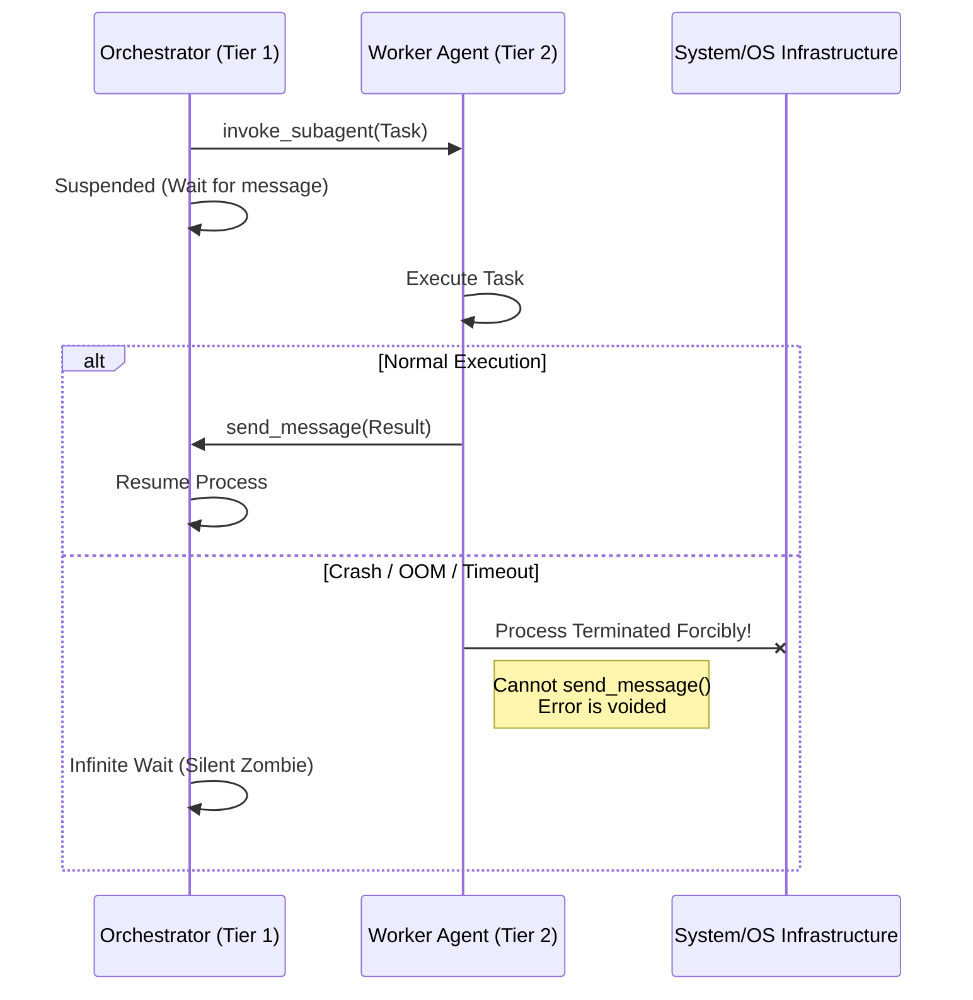

# As-Is Issue Catalog

本ドキュメントは、現在の Agentic OS における技術的負債および UX/セキュリティ上の課題をまとめた公式の課題カタログ（Issue Catalog）である。ここで挙げられた課題は、次期アーキテクチャ（To-Be）において解決すべき要求事項の基盤となる。

---

## 1. アーキテクチャ・設計レベルの負債

### 1.1 JIT Routing (マニュアルでのルール読み込み) の破綻
- **事象**: `AGENT.md` や `SKILL.md` などのルールを「着手時に必ず読め」と Agent に指示（Soft Constraint）しているが、具体的なタスク指示（HOW）が来た際にメタ的な儀式が読み飛ばされる。
- **原因**: エージェントの自律性にルールの事前読み込みを依存している。
- **影響**: コンテキストの欠落によるハルシネーションやルール違反の発生。

### 1.2 多重レビュー・オーケストレーションのAgentへの丸投げ
- **事象**: 品質ゲート（影響分析、コンプライアンスレビュー等）の呼び出しを、作業を担当する Tier 1 Agent 自身にオーケストレーションさせている。
- **原因**: 開発タスクより手続きが重く、Agent が「早くコードを書きたい」という Reward Hacking に陥り、検証をスキップする。
- **影響**: 品質の低下、ハルシネーションによるアーキテクチャ破壊。

### 1.3 進捗・ステートの自己トラッキング (`progress.md` 等)
- **事象**: Markdown のチェックボックス等を用いた状態管理を Agent 自身に Diff ツールなどで手動更新させている。
- **原因**: 状態の永続化を Agent のテキスト操作（自由記述）に依存している。
- **影響**: 更新ミス、認知負荷の増大による本来のタスク処理能力の低下。

### 1.4 高度すぎる思考プロセスの一律要求
- **事象**: Second Brain への単なる知識整理タスクにおいて、「反証やアナロジーの付与」といった高度な推論プロセスを一律で強要している。
- **原因**: 日常の整理タスクと、高度な知の蒸留タスクが同一の Worker に混在している。
- **影響**: トークン消費と処理時間の不必要な増大。

---

## 2. MUST-Level Debts (Security, UX, Error Recovery)

システムを刷新するにあたり、以下の負債は **MUST 要件** として解決されなければならない。

### 2.1 Security & Data Isolation
**「Leave No Trace」原則の破綻によるデータ漏洩・永続化リスク**

1. **`scratch/` ディレクトリの永続化**: `verify_cleanliness.py` で `scratch/` がチェック除外されており、エラーログや機密データがローカルディスクに永続化される。
2. **盲目的な `git add .` によるクレデンシャル流出**: `session-manager` の Handoff 時に確認なしに `git add .` が実行されるため、一時的に展開された `.env` などが Git リポジトリに混入・Push されるリスクがある。
3. **Workspaces 内データの Git 永続化**: ユーザーのプライベート情報や生データを含む `tasks/progress.md` や `tasks/context.md` が Git 管理下にあるため、機密データが不可逆的に履歴に残る。
4. **Handoff ログの意図的な追跡**: `.gitignore` において `!events/handoff_*.md` と設定されており、セッションの会話内容や処理されたコンテキストがソースコードと共にリポジトリに保存されてしまう。

### 2.2 User Experience (UX & Cognitive Load)
**Fat Orchestration とツールの脆さによる人間への過度な負担**

1. **人間の介入前提のハンドオフ設計 (Eliminate Manual Handoffs)**: エラー発生時に自律的なリカバリができず、頻繁にハンドオフが失敗する。ユーザーが状態を整え、手動で次の指示を出すマイクロマネジメントが強いられている。
2. **人間に読ませることを前提としない状態管理**: 巨大な進捗ファイル（JSON/Markdown）をユーザーが直接読んでデバッグしなければならず、「OSのデバッグ」に認知リソースが奪われる。
3. **ツールの脆さとフェイルセーフの欠如**: 軽微なフォーマットエラー等で Agent が停止し、自己修復（Self-healing）できない。ユーザーが「人間API」として介入・要約を行う羽目になる。

### 2.3 Error Recovery & Execution
**エラーの闇への消失 (The "Voiding" of Errors) とサイレント・デッドロック**

Tier 2 Worker が未処理例外や OOM によってプロセスごと強制終了された場合、死に際に Orchestrator へエラー報告（`send_message`）ができないため、システムがサイレントハングする。

**解決要件**:
1. **Lifecycle Supervisor の導入**: エージェントプロセスの死を検知し、代理でエラーイベントを発行するスーパーバイザの導入。
2. **Timeout / Deadline 管理の強制**: 無限待機を禁止し、Watchdog パターンでタイムアウト超過時に強制的に回復シーケンスへ移行する。
3. **エラーコンテキストの永続化と DLQ**: 処理不能タスクを Dead Letter Queue に退避し、事後分析を可能にする。

---

## 3. 総括

現状の Agentic OS は、 Agent の自律性に過度に依存しており、結果として **「セキュリティホールの拡大」「ユーザーへの過度な認知負荷（手動介入）」「クラッシュに対する脆弱性」** という MUST レベルの負債を抱えている。

次期アーキテクチャでは、**「Agent への責務丸投げ」を排し、システム（OS、インフラ、CIパイプライン）側への「責務の移譲・再配置」** を行うことが不可欠である。
